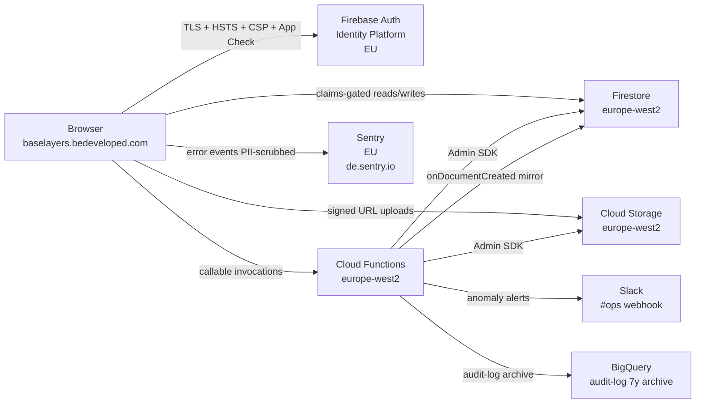

<objective>
Author `THREAT_MODEL.md` (DOC-03) at repo root and `docs/DATA_FLOW.md` (DOC-07). Both documents catalogue what already exists in code + tests + runbooks; no new threat analysis is required (per-Phase plan `<threat_model>` blocks already enumerate granular threats — these documents are the auditor-facing synthesis).

THREAT_MODEL.md uses STRIDE in prose: 4 trust boundaries + 6 threat categories (auth bypass, tenant boundary breach, file upload abuse, denial of wallet, supply-chain compromise, insider misuse) + defence-in-depth summary. Every category has a "Mitigations" block citing existing controls and an "Evidence" block citing the SECURITY.md section where details live.

DATA_FLOW.md uses a Mermaid `flowchart LR` (GitHub renders natively — no plugin needed), followed by data classifications + processing regions tables. All node regions match Wave 2 PRIVACY.md verification.

Output: 2 docs + 2 doc-shape tests.
</objective>

<execution_context>
@$HOME/.claude/get-shit-done/workflows/execute-plan.md
@$HOME/.claude/get-shit-done/templates/summary.md
</execution_context>

<context>
@.planning/STATE.md
@.planning/phases/11-documentation-pack-evidence-pack/11-RESEARCH.md
@.planning/phases/11-documentation-pack-evidence-pack/11-01-SUMMARY.md
@.planning/phases/11-documentation-pack-evidence-pack/11-02-SUMMARY.md
@SECURITY.md
@PRIVACY.md
@.planning/research/PITFALLS.md

<interfaces>
<!-- Verbatim templates lifted from RESEARCH.md. Use these as the document body. -->

THREAT_MODEL.md template (RESEARCH.md §"Pattern 3"):
- Header: "# Threat Model — Base Layers Diagnostic"
- 4 trust boundaries (numbered list 1-4)
- 6 threat categories: T1 Authentication bypass / T2 Tenant boundary breach (cross-org IDOR) / T3 File upload abuse / T4 Denial of wallet (cost exhaustion) / T5 Supply-chain compromise / T6 Insider misuse
- Each category has 3 sub-blocks: Threat / Mitigations / Evidence
- Defence-in-depth summary table (6 layers × Control column)

DATA_FLOW.md template (RESEARCH.md §"Pattern 4"):
- Mermaid `flowchart LR` with 8 nodes (Client / Auth / Firestore / Storage / Functions / Sentry / Slack / BigQuery)
- 9 labelled edges
- Data classifications table (4 rows × 5 cols)
- Processing regions list (4 bullets)

Mermaid block (verbatim from RESEARCH.md):


If Wave 2 PRIVACY.md found a Cloud Storage region differing from europe-west2, the Mermaid `Storage[...]` node label and the `## Processing regions` bullet must reflect the verified region.
</interfaces>
</context>

<tasks>

<task type="auto" tdd="true">
  <name>Task 1: Author tests/threat-model-shape.test.js + tests/data-flow-shape.test.js (RED)</name>
  <files>tests/threat-model-shape.test.js, tests/data-flow-shape.test.js</files>
  <read_first>
    - .planning/phases/11-documentation-pack-evidence-pack/11-RESEARCH.md §"Pattern 3" + §"Pattern 4" (target shapes)
    - tests/privacy-md-shape.test.js (Wave 2 test pattern)
    - tests/security-md-toc.test.js (Wave 1 test pattern)
  </read_first>
  <behavior>
    tests/threat-model-shape.test.js (8 cases):
    - Test 1: THREAT_MODEL.md exists at repo root
    - Test 2: H1 heading equals `# Threat Model — Base Layers Diagnostic`
    - Test 3: contains a `## Trust boundaries` (or `## Trust Boundaries`) section with at least 4 numbered items (regex: `/^[1-4]\. \*\*/m` matches >= 4 items)
    - Test 4: contains `## Threat categories` heading
    - Test 5: contains exactly 6 threat sub-headings: T1 / T2 / T3 / T4 / T5 / T6 — match `/^### T[1-6]\. /m` returns 6 hits
    - Test 6: each T1-T6 category contains the bold sub-block markers `**Threat:**` AND `**Mitigations:**` AND `**Evidence:**` (split by `### T` boundaries; assert each slice contains all 3 markers)
    - Test 7: contains `## Defence in depth summary` (or "Defense" — accept both spellings) with a markdown table with at least 6 layer rows
    - Test 8: Pitfall 19 forbidden-words check — no `\b(compliant|certified)\b` outside code spans

    tests/data-flow-shape.test.js (7 cases):
    - Test 1: docs/DATA_FLOW.md exists
    - Test 2: contains H1 `# Data Flow` (or similar) heading
    - Test 3: contains a Mermaid fenced block — match ` ```mermaid\s*\n[\s\S]+?\n``` `
    - Test 4: Mermaid block contains all 8 expected node identifiers: Client / Auth / Firestore / Storage / Functions / Sentry / Slack / BigQuery
    - Test 5: Mermaid block contains at least 9 edges (regex match for ` -->` count >= 9)
    - Test 6: contains a `## Data classifications` table with at least 4 data-class rows (Customer business / User account / Operational / Error telemetry)
    - Test 7: contains a `## Processing regions` list citing `europe-west2` AT LEAST 3 times (Firestore + Functions + Storage if confirmed europe-west2)

    Both suites MUST FAIL initially.
  </behavior>
  <action>
Use the readFileSync-and-regex pattern from `tests/privacy-md-shape.test.js`. Implement the 8 + 7 cases per behavior block.

For Mermaid block extraction (data-flow Test 3), use multiline regex: `const mermaidBlock = src.match(/```mermaid\s*\n([\s\S]+?)\n```/)?.[1] ?? "";` — then assert it contains the 8 node identifiers (Test 4) and edge count >= 9 (Test 5).

For threat-model Test 6, split on `### T` and process each slice individually:
```javascript
const slices = src.split(/^### T\d/m).slice(1, 7); // 6 slices for T1-T6
expect(slices.length).toBe(6);
slices.forEach((slice, idx) => {
  expect(slice, `T${idx+1} Threat`).toContain("**Threat:**");
  expect(slice, `T${idx+1} Mitigations`).toContain("**Mitigations:**");
  expect(slice, `T${idx+1} Evidence`).toContain("**Evidence:**");
});
```

Run `npm test -- --run threat-model-shape data-flow-shape` and confirm RED. Commit: `test(11-03): add THREAT_MODEL + DATA_FLOW shape tests (RED)`.
  </action>
  <verify>
    <automated>npm test -- --run threat-model-shape data-flow-shape 2>&1 | grep -E "FAIL|failed" (must show failures)</automated>
  </verify>
  <done>Both test files exist with the cases above; running shows RED gate; committed.</done>
</task>

<task type="auto" tdd="true">
  <name>Task 2: Author THREAT_MODEL.md + docs/DATA_FLOW.md (GREEN)</name>
  <files>THREAT_MODEL.md, docs/DATA_FLOW.md</files>
  <read_first>
    - .planning/phases/11-documentation-pack-evidence-pack/11-RESEARCH.md §"Pattern 3" + §"Pattern 4" (paste-ready templates)
    - PRIVACY.md (Wave 2 — confirm Storage region for Mermaid node label)
    - .planning/phases/11-documentation-pack-evidence-pack/11-02-VERIFICATION-LOG.md (Storage region verification)
    - tests/threat-model-shape.test.js + tests/data-flow-shape.test.js (contracts to satisfy)
    - SECURITY.md § Cloud Functions Workspace + § App Check + § Audit Log Infrastructure + § Authentication & Sessions (cross-reference targets for THREAT_MODEL.md Evidence blocks)
    - .planning/research/PITFALLS.md (only if Mitigations bullets need richer cross-reference)
  </read_first>
  <behavior>
    THREAT_MODEL.md exists at repo root containing:
    - H1: "# Threat Model — Base Layers Diagnostic"
    - Frontmatter paragraph: Last updated 2026-05-10 / Methodology STRIDE / Scope (production app + Firebase project + source repo)
    - `## Trust boundaries` with 4 numbered items (Browser↔Firebase backplane / Firebase Auth↔Functions/Firestore/Storage / Functions↔external services / Operator↔Firebase Console+GCP Console)
    - `## Threat categories` heading
    - 6 sub-sections `### T1.` through `### T6.` each with `**Threat:**` / `**Mitigations:**` / `**Evidence:**` blocks
    - `## Defence in depth summary` with 6-row table
    - Pitfall 19 substrate-honest: every Evidence block points to a real file path or SECURITY.md section

    docs/DATA_FLOW.md exists containing:
    - H1: "# Data Flow — Base Layers Diagnostic"
    - `## Diagram` heading
    - Mermaid `flowchart LR` block with 8 nodes + 9+ edges
    - `## Data classifications` table (4 rows × 5 cols: Class | Examples | Storage location | Encryption | Access control)
    - `## Processing regions` bulleted list (Primary europe-west2 / Auth EU / Telemetry EU / Logs europe-west2)

    Cross-document consistency: Cloud Storage region in DATA_FLOW.md Mermaid + Processing regions matches PRIVACY.md Section 3.
  </behavior>
  <action>
Step 1 — THREAT_MODEL.md. Use the Write tool. Paste the entire RESEARCH.md §"Pattern 3" template body, with these substitutions:

- `**Last updated:** 2026-05-10`
- Trust boundaries 1-4 verbatim
- T1-T6 verbatim (the template's Threat / Mitigations / Evidence text already cites real paths)
- Defence in depth summary table verbatim
- Append a closing paragraph: `**Source artefacts:** Per-phase plan `<threat_model>` blocks under `.planning/phases/{NN}/{NN-XX}-PLAN.md` are the granular substrate; this document is the auditor-facing synthesis. Cross-references in each Evidence block point to `SECURITY.md` sections where implementation details live.`

Step 2 — docs/DATA_FLOW.md. Use the Write tool. Paste the entire RESEARCH.md §"Pattern 4" template body, with these substitutions based on PRIVACY.md Wave 2 verification:

- If PRIVACY.md confirmed Cloud Storage region as `europe-west2`, the Mermaid Storage node remains `Storage[Cloud Storage<br/>europe-west2]` and the `## Processing regions` line stays "Primary: europe-west2 (London) — Firestore, Cloud Functions, Cloud Storage"
- If PRIVACY.md found a different Storage region, update the Mermaid Storage node label AND the Processing regions line to reflect that
- If PRIVACY.md left A3 ASSUMED-PER-A3, the Mermaid Auth node retains `Auth[Firebase Auth<br/>Identity Platform<br/>EU]` but add a footnote below the Mermaid block: `*Auth region (Identity Platform): see PRIVACY.md Section 3 — verification path documented in 11-02-VERIFICATION-LOG.md.*`

Run `npm test -- --run threat-model-shape data-flow-shape` — must be GREEN. Run `npm test -- --run` full suite — zero regressions.

Commit: `docs(11-03): author THREAT_MODEL.md + docs/DATA_FLOW.md (DOC-03 + DOC-07; GREEN)`.

Verify the Mermaid block renders by `git push` to the branch and visually checking the GitHub PR view (operator action — surface in <output> block of summary, not as a blocking gate; the doc-shape test only validates structure, not visual rendering).
  </action>
  <verify>
    <automated>npm test -- --run threat-model-shape data-flow-shape 2>&1 | grep -E "passed|failed" (must show all green)</automated>
    <automated>npm test -- --run 2>&1 | tail -5 (full suite zero regressions)</automated>
    <automated>test -f THREAT_MODEL.md && test -f docs/DATA_FLOW.md && grep -c "^### T[1-6]\." THREAT_MODEL.md (must be 6) && grep -c "europe-west2" docs/DATA_FLOW.md (must be >= 3)</automated>
  </verify>
  <done>THREAT_MODEL.md at repo root with 6 STRIDE categories; docs/DATA_FLOW.md with Mermaid + classifications + regions; both shape tests GREEN; full suite zero regressions; cross-document region consistency with PRIVACY.md.</done>
</task>

</tasks>

<threat_model>
## Trust Boundaries

| Boundary | Description |
|----------|-------------|
| Reader (auditor) → THREAT_MODEL.md | Auditor uses STRIDE document to map controls; missing categories or stale evidence undermines threat-coverage claim |
| docs/DATA_FLOW.md → PRIVACY.md / SECURITY.md | Region claims must agree across documents; Mermaid + table + prose must be internally consistent |

## STRIDE Threat Register

| Threat ID | Category | Component | Disposition | Mitigation Plan |
|-----------|----------|-----------|-------------|-----------------|
| T-11-03-01 | Repudiation | Mermaid block parse failure on GitHub | mitigate | tests/data-flow-shape.test.js Test 3 regex check; operator visual verification on PR (surfaced in summary not gate) |
| T-11-03-02 | Repudiation | Threat category drift (categories misnamed or skipped) | mitigate | tests/threat-model-shape.test.js Tests 5+6 enforce T1-T6 with all 3 sub-blocks |
| T-11-03-03 | Information Disclosure | DATA_FLOW.md region claim contradicts PRIVACY.md | mitigate | Task 2 reads Wave 2 verification log; cross-document consistency assertion in <verify> grep |
| T-11-03-04 | Repudiation | Pitfall 19 forbidden-words drift | mitigate | tests/threat-model-shape.test.js Test 8 forbidden-words check |

</threat_model>

<verification>
- All 2 tasks committed via Conventional Commits prefix `docs(11-03)` or `test(11-03)`
- `npm test -- --run threat-model-shape data-flow-shape` GREEN
- `npm test -- --run` full-suite zero regressions
- `grep -c "^### T[1-6]\." THREAT_MODEL.md` returns 6
- `grep -c "europe-west2" docs/DATA_FLOW.md` returns >= 3
- Cross-doc consistency check: `grep "europe-west2" PRIVACY.md docs/DATA_FLOW.md THREAT_MODEL.md` shows same region for the same nouns
</verification>

<success_criteria>
- DOC-03: THREAT_MODEL.md at repo root with 4 trust boundaries + 6 STRIDE categories + defence-in-depth summary
- DOC-07: docs/DATA_FLOW.md with Mermaid (8 nodes + 9+ edges) + classifications table + processing regions
- Both shape tests green; full suite zero regressions
- Region claims consistent across PRIVACY.md / DATA_FLOW.md / THREAT_MODEL.md
- Pitfall 19 forbidden-words zero hits in both new docs
</success_criteria>

<output>
After completion, append to `.planning/phases/11-documentation-pack-evidence-pack/11-03-SUMMARY.md`: trust boundary count, threat category count, Mermaid edge count, Mermaid render verification (manual operator check on GitHub PR — flag PENDING-OPERATOR if not yet done), commits SHAs.
</output>
