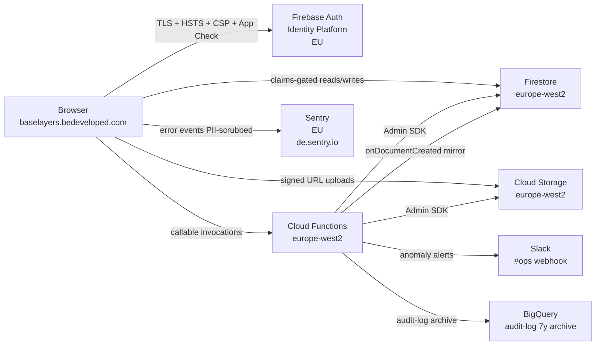

# Phase 11: Documentation Pack (Evidence Pack) — Research

**Researched:** 2026-05-10
**Domain:** Compliance documentation + evidence pack authoring (cataloguing existing controls — NOT new design)
**Confidence:** HIGH (the phase is a literal cataloguing exercise; everything being documented already exists in code, tests, runbooks, or prior `SECURITY.md` increments through Phases 1–10)

---

## Summary

Phase 11 is a **documentation-only phase**. With Phase 1–10 substrate landed, every control claimed in the evidence pack already exists in code, tests, or operator runbooks. This phase is the literal cataloguing pass: walk every closed `SECURITY.md` section, extract the control claim, prove it via `(code path | config | test | framework citation)` rows in `docs/CONTROL_MATRIX.md`, and write the surrounding policy documents (`PRIVACY.md`, `THREAT_MODEL.md`, `docs/RETENTION.md`, `docs/IR_RUNBOOK.md`, `docs/DATA_FLOW.md`) plus the published-on-the-wire artefacts (`/.well-known/security.txt`, vulnerability disclosure paragraph in `SECURITY.md`).

The single load-bearing risk is **Pitfall 19 (compliance theatre)**: claiming controls without backing evidence. Every row in `CONTROL_MATRIX.md` MUST cite a real file at a real path; every claim in `PRIVACY.md` MUST cite a verified fact (e.g., `europe-west2` Firestore region — verified 2026-05-08 in `06-PREFLIGHT.md` line 37); every "compliance posture" statement MUST use the project-locked phrasing **"credible, not certified"** — never "compliant", never "certified", never "ASVS L2 compliant". The compliance posture statement already exists in `SECURITY.md` lines 1271–1278 — Phase 11 inherits that language.

The phase is also the **canonical owner of DOC-10**. Each prior phase appended its `SECURITY.md` section (Pitfall 19 prevention — write evidence in lockstep with the control). Phase 11 does the final structural pass: ToC, cross-references, broken-link sweep, citation-format normalisation, deduplication of overlapping claims (e.g., does the Phase 4 § Code Quality section and the Phase 10 § CSP enforced section cite ASVS V14.4 with the same wording?).

**Primary recommendation:** Run Phase 11 as **6 waves**. Wave 1: structural plumbing (CONTROL_MATRIX skeleton + DOC-10 final pass on existing SECURITY.md). Wave 2: PRIVACY.md (sub-processors + Firestore region + DPA/SCC URLs — all verifiable facts). Wave 3: THREAT_MODEL.md + DATA_FLOW.md (STRIDE/written prose; data flow diagram). Wave 4: RETENTION.md + IR_RUNBOOK.md (mostly extant — RETENTION.md exists with rate-limit row; IR runbooks live in `runbooks/` already). Wave 5: `/.well-known/security.txt` (new file + firebase.json hosting strategy + vulnerability disclosure paragraph polish). Wave 6: docs/evidence/ index + cross-reference verification + broken-citation sweep + cleanup-ledger + REQUIREMENTS.md flips.

---

<user_constraints>
## User Constraints (from CONTEXT.md)

### Locked Decisions

CONTEXT.md reports `Mode: Auto-generated (discuss skipped via workflow.skip_discuss)`. There are no user-locked decisions for this phase — all implementation choices fall to **Claude's Discretion**.

The following project-wide constraints (from `CLAUDE.md` + `.planning/PROJECT.md` + `SECURITY.md`) are inherited and binding for Phase 11:

- **Stay on Firebase.** No platform migration in this milestone.
- **Stay on vanilla JS** + Vite + Vitest + JSDoc-as-typecheck.
- **Compliance bar = credible, NOT certified** (Pitfall 19). Use language like "credible / on track for SOC2 + ISO 27001 + GDPR Art. 32 / OWASP ASVS L2" — never "compliant", "compliant with", "certified", or "ASVS L2 compliant".
- **No emojis** in commit messages or in source/docs unless explicitly asked. (RFC 9116 `security.txt` uses ASCII.)
- **Conventional Commits** — `docs:` for documentation work.
- **Source layout target reached** — `firebase/` + `data/` + `domain/` + `auth/` + `cloud/` + `views/` + `ui/` + `observability/` (Phase 4 close).
- **`.planning/` is committed** (per config — `commit_docs: true`).
- **Each phase increments `SECURITY.md`** — Phase 11 owns the canonical DOC-10 final pass.

### Claude's Discretion

All Phase 11 implementation choices are at Claude's discretion. Refer to ROADMAP success criteria + this research's Recommended Approach + codebase conventions.

### Deferred Ideas (OUT OF SCOPE)

CONTEXT.md `<deferred>` block: "None — discuss phase skipped."

Implicitly out-of-scope from PROJECT.md and prior phases:

- **SOC2 Type II audit / ISO 27001 certification** — separate workstream (PROJECT.md Out of Scope; OPS-V2-02 + OPS-V2-03).
- **External pen test** — OPS-V2-01.
- **Continuous-compliance scanner (Vanta / Drata)** — OPS-V2-04.
- **Customer-facing Trust Centre** as a public webpage (`bedeveloped.com/security`) — listed as differentiator in `FEATURES.md` line 174; not in v1.
- **PGP / OpenPGP key for security disclosure** — RFC 9116 `Encryption:` field is OPTIONAL; defer unless user asks. `security@bedeveloped.com` is the disclosure channel.
- **MFA recovery codes** — superseded by email-link recovery per Phase 6 D-07. Document the email-link recovery flow in `SECURITY.md`, NOT recovery codes.

</user_constraints>

<phase_requirements>
## Phase Requirements

| ID | Description | Research Support |
|----|-------------|------------------|
| **DOC-01** | `SECURITY.md` — controls catalogue mapped to OWASP ASVS L2 / ISO 27001:2022 Annex A / SOC2 CC / GDPR with explicit citations; disclosure contact `security@bedeveloped.com`; supported versions; MFA recovery procedure; rotation schedule | `SECURITY.md` is already extensively populated (1278 lines / 34 `## §` sections / 6 Audit Indexes for Phases 3 + 5 + 6 + 7 + 8 + 9 + 10). Phase 11 is the canonical final pass: ToC, cross-references, broken-link sweep, citation-format normalisation, MFA recovery procedure paragraph (currently only in Phase 6 inline), rotation schedule paragraph (currently only in Phase 1 § Secret Scanning + Phase 7 § Secrets management). See "Existing SECURITY.md Inventory" + "Final-Pass Checklist". |
| **DOC-02** | `PRIVACY.md` — sub-processors, Google Cloud DPA reference, retention periods, **verified** Firestore data residency region, SCCs, data subject rights flow | New file. Sub-processors confirmed: (1) Google Cloud Platform / Firebase, (2) Sentry (`*.ingest.de.sentry.io` — EU). Google Fonts is NO LONGER a sub-processor — Phase 4 self-hosted Inter + Bebas Neue under `assets/fonts/` (`SECURITY.md` line 207 confirms; CSP allowlist drops `fonts.googleapis.com` + `fonts.gstatic.com`). Firestore region = `europe-west2` (verified 2026-05-08 in `06-PREFLIGHT.md` lines 37–48). Google Cloud DPA URL: `https://cloud.google.com/terms/data-processing-addendum`; Firebase-specific terms: `https://firebase.google.com/terms/data-processing-terms`. Retention numbers come from `docs/RETENTION.md` + Phase 8 § Backups + DR section in `SECURITY.md`. Data subject rights flow: GDPR-01 + GDPR-02 callables (`gdprExportUser` + `gdprEraseUser`) shipped Phase 8. |
| **DOC-03** | `THREAT_MODEL.md` — STRIDE-style or written prose covering: auth bypass, tenant-boundary breach, file upload abuse, denial-of-wallet, supply-chain compromise, insider misuse | New file. Source material is rich: every Phase plan has a `<threat_model>` block with STRIDE-tagged threat IDs (T-N-NN-NN format). `.planning/research/PITFALLS.md` 20 pitfalls map to threat patterns. The 6 required threat categories all have already-implemented mitigations to cite. |
| **DOC-04** | `docs/CONTROL_MATRIX.md` — table mapping each claimed control to (code path | config | doc | test | framework citation) | New file. The most labour-intensive deliverable. Source rows: walk every `## §` section in `SECURITY.md` + extract one row per control. ~80–120 expected rows across requirement categories TOOL/TEST/HOST/CODE/DATA/RULES/AUTH/FN/AUDIT/LIFE/GDPR/BACKUP/OBS/DOC. Sample populated rows in "CONTROL_MATRIX.md Row Template + Examples" section below. |
| **DOC-05** | `docs/RETENTION.md` — per-data-class retention period, basis, deletion mechanism (org data; user data; audit log 12mo + 7y archive; backups 90d Nearline + 365d Archive; chat; documents) | File EXISTS (62 lines; 1 row — Rate Limiting FN-09 from Phase 7). Phase 11 expands: 7+ data-class rows. All retention values are pre-decided + cited in existing SECURITY.md sections (Phase 7 § Audit Log Infrastructure for 12mo+7y; Phase 8 § Backups for 30d→Nearline@30d→Archive@365d; Phase 9 PII scrubber for chat/comments). |
| **DOC-06** | `docs/IR_RUNBOOK.md` — runbooks for credential compromise, data leak / Rules bypass, dependency CVE, supply-chain compromise, lost backup; per-scenario: trigger, owner, decision tree, comms template, RCA template | New file. Substrate exists in `runbooks/`: 31 runbooks across cutover / restore-drill / soak / deploy-checkpoint / MFA-recovery-drill patterns. Phase 11 builds the IR_RUNBOOK index per scenario and links to existing runbook patterns. |
| **DOC-07** | `docs/DATA_FLOW.md` — diagram + prose: Client → Firebase Auth → Firestore → Storage → Cloud Functions → Sentry; data classifications, processing regions | New file. All flows already documented across `SECURITY.md` § Authentication + § Cloud Functions Workspace + § App Check + § Data Handling + § Observability — Sentry. Phase 11 unifies into a single flow diagram + prose narrative. Use Mermaid for the diagram (renders in GitHub markdown; no external tool dependency). |
| **DOC-08** | `/.well-known/security.txt` (RFC 9116) plus vulnerability disclosure policy paragraph in `SECURITY.md` (acknowledge in 5 business days, no legal action against good-faith researchers) | New artefact. RFC 9116 minimum required fields = `Contact:` + `Expires:`. Phase 1 already authored a placeholder vulnerability-disclosure-policy paragraph in `SECURITY.md` lines 7–15 — Phase 11 finalises wording. See "RFC 9116 security.txt Field Set + Hosting Strategy" section. |
| **DOC-09** | `docs/evidence/` — VSQ-ready evidence pack: screenshots of MFA enrolment for Luke + George; sample audit-log entry (PII redacted); backup-policy console screenshot; Firestore region screenshot; App Check enforcement state per service; rules deployment timestamp; latest CI green run; latest `npm audit` clean output | Directory EXISTS with 2 captures so far: `branch-protection-screenshot.png` + `socket-install.png` (Phase 1 evidence). Phase 11 inventories required vs captured-pending (operator-deferred captures mostly batched into Phase 8 + 9 + 10 deferred-checkpoint sessions). Several items are **PENDING-OPERATOR** at Phase 11 entry — Phase 11 documents them as PENDING-OPERATOR and references the deferred-checkpoint document, NOT silently skips (Pitfall 19). |
| **DOC-10** | Each phase incrementally appends to `SECURITY.md` as it closes findings — Phase 11 is the canonical owner / final pass | Already 6 increments shipped (Phases 1 / 3 / 4 / 5 / 6 / 7 / 8 / 9 / 10); Phase 2 is the test-suite phase whose evidence flows into Phase 4's `SECURITY.md` § Build & Supply Chain "Regression baseline (Phase 2)" paragraph (lines 51–73). Phase 11 verifies every closed CONCERNS.md finding has a corresponding paragraph + every paragraph has a citation — no orphan claims, no orphan citations. |

</phase_requirements>

## Project Constraints (from CLAUDE.md)

| Directive | Source | How Phase 11 Honours |
|-----------|--------|----------------------|
| Read `.planning/PROJECT.md` + `ROADMAP.md` + `STATE.md` + `REQUIREMENTS.md` + `.planning/research/SUMMARY.md` + `.planning/codebase/*` first | CLAUDE.md "Read these first" | Researcher loaded all 6 + this RESEARCH.md preamble cites them. Planner re-loads. |
| **Stay on Firebase. No Vercel + Supabase migration.** | CLAUDE.md "Locked decisions" | `PRIVACY.md` sub-processors list = Google/Firebase + Sentry only (Phase 11 confirms Google Fonts is NOT a sub-processor post-Phase-4). |
| **Stay on vanilla JS.** | CLAUDE.md "Locked decisions" | Documentation phase — no code framework choices to make. |
| **No backwards-compatibility window.** | CLAUDE.md | Phase 11 docs reflect current production state, not a transition state. |
| **Compliance bar = credible, not certified.** | CLAUDE.md / PROJECT.md / SECURITY.md line 1273 | Phrasing "**credible, not certified**" is the only acceptable form. Forbidden words: "compliant", "compliant with", "certified", "audited", "ASVS L2 compliant", "SOC2 compliant". Acceptable forms: "on track for", "credible against", "aligned to". |
| **12-phase plan justified by 4 sequencing constraints.** | CLAUDE.md / ROADMAP.md "Granularity Rationale" | Phase 11 doc lists 12 phases verbatim from ROADMAP.md — no re-numbering. |
| **Conventional Commits — `docs:`** | CLAUDE.md "Conventions" | Every Phase 11 wave commit uses `docs(11):` or `docs(11-NN):` prefix. |
| **`.planning/` is committed.** | CLAUDE.md "Conventions" | Phase artefacts under `.planning/phases/11-documentation-pack-evidence-pack/` are committed normally. |
| **No emojis in commit messages or source unless asked.** | CLAUDE.md / MEMORY user_context | RFC 9116 `security.txt` is ASCII — no Unicode symbols. SECURITY.md / PRIVACY.md / etc use plain ASCII headers (existing SECURITY.md uses `## §` paragraph-section glyph — that's NOT an emoji, that's the section sign U+00A7 already used 34 times; preserve the convention). |
| **Keep responses tight — show diffs, don't over-explain.** | CLAUDE.md / MEMORY feedback_decisive | Plans should produce concrete file-paste templates, not narrative. |
| **Source layout target post-Phase-4 reached.** | CLAUDE.md | All `src/*` paths cited in CONTROL_MATRIX.md must use the post-Phase-4 layout — verify against `git ls-files src/`. |
| **`domain/*` files import nothing from Firebase (lint-enforced).** | CLAUDE.md | Phase 11 cites this as an evidence row in CONTROL_MATRIX.md (closes T-4-3-1; ASVS V14.2 Code Integrity). |

---

## Standard Stack

### Core (Documentation Tooling)

| Library / Tool | Version | Purpose | Why Standard |
|----------------|---------|---------|--------------|
| **Markdown** (CommonMark) | n/a | All `.md` files | Already the project's documentation format; renders natively in GitHub UI; no build step. |
| **Mermaid** (GitHub-native) | n/a (rendered by GitHub) | Diagrams in `DATA_FLOW.md` + `THREAT_MODEL.md` (optional) | GitHub renders ` ```mermaid ` fenced blocks server-side without external deps. No PlantUML / Graphviz / draw.io tooling pollution. [VERIFIED: github.com docs] |
| **RFC 9116** (security.txt) | RFC 9116 | `/.well-known/security.txt` | IETF Proposed Standard published April 2022 — the only standard format for vulnerability disclosure metadata. [CITED: rfc-editor.org/rfc/rfc9116.html] |

### Hosting (existing — no change)

| Surface | Path | Mechanism |
|---------|------|-----------|
| Firebase Hosting `public` dir | `dist/` (per `firebase.json` line 3) | Vite build emits to `dist/`; CI deploys via `firebase deploy --only hosting` |
| Static asset directory | `public/data/` (existing, served at root via Vite `publicDir`) | Vite copies `public/*` to `dist/*` during build |

### `security.txt` Hosting Decision

**Recommendation:** Drop `security.txt` into `public/.well-known/security.txt`. Vite's default `publicDir` is `public/` — files in `public/` are copied to `dist/` at build time, preserving directory structure. This means **no `firebase.json` rewrite is needed** — `dist/.well-known/security.txt` is served by Firebase Hosting at `https://baselayers.bedeveloped.com/.well-known/security.txt` with the standard CSP + HSTS + `Cache-Control: public, max-age=31536000, immutable` headers (`firebase.json` line 31–33 wildcard).

Verify Vite picks it up: existing `public/data/` directory already proves the pattern works (currently empty per `ls public/`, but the directory exists). Wave 5 plan should add a `tests/` sanity test asserting `dist/.well-known/security.txt` exists post-build (analogous to `tests/build/source-map-gate.test.js` Phase 9 pattern).

**Alternative considered:** `firebase.json` rewrite to a Cloud Function. **Rejected** because (a) introduces unnecessary cold-start + invocation cost for a static file, (b) violates Pitfall 8 selective-deploy boundary (would require redeploying Cloud Functions for a docs change), (c) RFC 9116 explicitly recommends a static file path.

**Caveat — `Cache-Control: max-age=31536000, immutable` is too aggressive for `security.txt`** because the `Expires:` field will require yearly rotation. Recommend adding a `firebase.json` `headers` entry specifically for `**/.well-known/**` with `Cache-Control: public, max-age=86400` (24h) so a new `Expires:` propagates within a day.

### Alternatives Considered

| Instead of | Could Use | Tradeoff |
|------------|-----------|----------|
| Mermaid for `DATA_FLOW.md` diagram | ASCII art | ASCII art is portable but harder to maintain; Mermaid is the GitHub-rendering standard. Mermaid wins. |
| Single `THREAT_MODEL.md` STRIDE | Microsoft Threat Modeling Tool (.tm7 files) | Tool-specific format invisible in GitHub UI; written prose + tabular STRIDE rows is the audit-friendly approach. Written prose wins. |
| `docs/evidence/` as PNG | `docs/evidence/` as PDF | PNG renders inline in GitHub PRs; PDF needs a download. PNG wins. |
| New `PRIVACY.md` at repo root | Inside `docs/` | `PRIVACY.md` at repo root pairs with `SECURITY.md` (also at repo root). Convention match. Repo root wins. |

**Installation:** No new dependencies needed.

**Version verification:** Not applicable — the only "version" in scope is RFC 9116, which is a published IETF standard (not a package).

---

## Architectural Responsibility Map

Phase 11 is documentation — no runtime tier mapping. The relevant axis is **document ownership** (where claims are authoritatively asserted vs cross-referenced):

| Capability | Primary Document | Secondary Document | Rationale |
|------------|------------------|---------------------|-----------|
| Control claims with citations | `SECURITY.md` | `docs/CONTROL_MATRIX.md` | `SECURITY.md` carries the prose narrative; `CONTROL_MATRIX.md` is the indexed view for auditors. Both must agree. |
| Sub-processor list | `PRIVACY.md` | `SECURITY.md` § Observability — Sentry (already cites Sentry EU sub-processor) | `PRIVACY.md` is canonical; `SECURITY.md` cross-references. |
| Retention windows | `docs/RETENTION.md` | `SECURITY.md` § Audit Log Infrastructure + § Backups | `RETENTION.md` is canonical; `SECURITY.md` paragraphs cite it. |
| Threat categories | `THREAT_MODEL.md` | per-Phase plan `<threat_model>` blocks | `THREAT_MODEL.md` is the auditor-facing summary; plan blocks are the granular substrate. |
| Data flow diagram | `docs/DATA_FLOW.md` | `SECURITY.md` § Cloud Functions Workspace + § Authentication | `DATA_FLOW.md` is the visual + prose narrative; SECURITY.md sections describe specific transitions. |
| IR runbooks | `docs/IR_RUNBOOK.md` | `runbooks/*.md` | `IR_RUNBOOK.md` is the indexed catalogue; `runbooks/*.md` are the executable artefacts. |
| Vulnerability disclosure | `/.well-known/security.txt` + `SECURITY.md` § Vulnerability disclosure policy | (none) | Both must carry the same `security@bedeveloped.com` contact + same 5-business-day acknowledgement promise. |
| Evidence captures | `docs/evidence/*.png` | `CONTROL_MATRIX.md` rows pointing at them | Captures are referenced by row; PENDING captures are documented PENDING-OPERATOR (Pitfall 19). |

---

## Existing SECURITY.md Inventory (Phase 11 starting point)

Already 1278 lines / 34 `## §` sections / 6 Audit Indexes. Structural breakdown:

| # | Section | Phase | Claim Density |
|---|---------|-------|---------------|
| 1 | Build & Supply Chain | Phase 1 + Phase 4 sub-section | ~10 evidence bullets |
| 2 | Data Handling | Phase 4 Wave 4 | ~8 evidence bullets |
| 3 | Code Quality + Module Boundaries | Phase 4 Wave 6 | ~12 evidence bullets |
| 4 | Dependency Monitoring | Phase 1 | ~5 |
| 5 | Secret Scanning | Phase 1 | ~3 |
| 6 | HTTP Security Headers | Phase 3 + Phase 4 Wave 1 sub-section | ~9 |
| 7 | Content Security Policy (enforced) | Phase 10 (replaces Report-Only) | ~14 (per-directive matrix) |
| 8 | HSTS Preload Status | Phase 10 | ~3 |
| 9 | Hosting & Deployment | Phase 3 | ~4 |
| 10 | Phase 3 Audit Index | Phase 3 + Phase 10 maintenance | 9 rows |
| 11 | Firestore Data Model | Phase 5 | ~6 |
| 12 | Firestore Security Rules — Authored, Not Yet Deployed | Phase 5 | ~8 |
| 13 | Storage Rules | Phase 5 | ~3 |
| 14 | Phase 5 Audit Index | Phase 5 | ~12 rows |
| 15 | Authentication & Sessions | Phase 6 | ~10 |
| 16 | Multi-Factor Authentication | Phase 6 | ~6 |
| 17 | Anonymous Auth Disabled | Phase 6 | ~3 |
| 18 | Production Rules Deployment | Phase 6 | ~5 |
| 19 | Phase 6 Audit Index | Phase 6 | ~14 rows |
| 20 | Cloud Functions Workspace | Phase 7 | ~8 |
| 21 | App Check | Phase 7 | ~6 |
| 22 | Audit Log Infrastructure | Phase 7 | ~10 |
| 23 | Rate Limiting | Phase 7 | ~5 |
| 24 | Phase 7 Audit Index | Phase 7 | 16 rows |
| 25 | Data Lifecycle (Soft-Delete + Purge) | Phase 8 | ~8 |
| 26 | GDPR (Export + Erasure) | Phase 8 | ~10 |
| 27 | Backups + DR + PITR + Storage Versioning | Phase 8 | ~9 |
| 28 | Phase 8 Audit Index | Phase 8 | 19 rows |
| 29 | Observability — Sentry | Phase 9 | ~8 |
| 30 | Audit-Event Wiring (AUDIT-05) | Phase 9 | ~8 |
| 31 | Anomaly Alerting (OBS-05) | Phase 9 | ~7 |
| 32 | Out-of-band Monitors (OBS-04/06/07/08) | Phase 9 | ~6 |
| 33 | Phase 9 Audit Index | Phase 9 | 10 rows |
| 34 | Phase 10 Audit Index | Phase 10 | 3 rows |
| (footer) | Compliance posture statement | Phase 10 line 1271–1278 | "credible, not certified" boilerplate already correct |

**Phase 11 SECURITY.md final-pass checklist:**

1. **Add ToC at top.** No ToC exists today. Add `## Table of Contents` immediately after the front matter (line 17 — "---").
2. **Add `## § Vulnerability disclosure policy` as a top-level `## §` section** (currently a quoted placeholder at lines 7–15). Final wording: 5 business day acknowledgement + safe-harbour language for good-faith researchers + scope (in-scope: production app at `baselayers.bedeveloped.com` and source repository; out-of-scope: third-party services like Firebase backplane and Sentry).
3. **Add `## § MFA Recovery Procedure` section.** Currently inline in Phase 6 narrative — promote to its own `## §` section. Document Tier-1 user-side email-link recovery + Tier-2 operator-side Admin SDK un-enrol per Phase 6 D-08. (DOC-01 explicitly requires "MFA recovery procedure".)
4. **Add `## § Rotation Schedule` section.** Currently scattered across Phase 1 § Secret Scanning + Phase 7 § Secrets management + Phase 9 OBS-05 secret rotation. Promote to its own section listing: SOPs/secrets quarterly, GitHub Actions OIDC (no rotation needed), Firebase service-account JSON (none — OIDC), Sentry DSN (manual, on suspected leak), Slack webhook URL (manual), GDPR_PSEUDONYM_SECRET (annually or on suspected leak). (DOC-01 explicitly requires "rotation schedule".)
5. **Add Supported Versions clarification.** Currently line 5: `**Supported versions:** main branch only (no released versions yet).` — keep as-is, but cross-reference to the production deploy at `baselayers.bedeveloped.com`.
6. **Citation-format normalisation.** Spot-check: every framework citation uses `OWASP ASVS L2 v5.0 V<N>.<N>` or `OWASP ASVS L2 V<N>.<N>` — pick one. Existing SECURITY.md mostly uses `OWASP ASVS L2 v5.0 V14.4.2` (with `v5.0`); standardise on that.
7. **Cross-reference verification.** Walk every `runbooks/`, `tests/`, `src/`, `functions/src/`, `firebase.json`, `firestore.rules`, `storage.rules`, `.github/workflows/ci.yml` reference in SECURITY.md and verify the file/line still exists. Phase 4–10 churn may have shifted line numbers; reference paths only (not line numbers) to make the doc resilient.
8. **Broken-link sweep.** Every URL (Firebase docs, Sentry docs, Google DPA, RFC 9116, etc.) — curl-test or eyeball-verify it 200s.

---

## Architecture Patterns

### Pattern 1: CONTROL_MATRIX.md — auditor's index view

**What:** A single-table file where every claimed control gets one row with five columns: `Requirement | Code Path(s) | Config | Test | Framework Citations`. Auditors love this format because it's grep-able and inverts the SECURITY.md narrative ("here's a control, here's the code") into a query-friendly form ("here's the requirement, where's the evidence?").

**When to use:** Always. This is the canonical DOC-04 deliverable.

**Row template (Pattern G — extends the existing Audit Index pattern in SECURITY.md Phase 7+8+9+10):**

```markdown
| Requirement | Control | Code | Test / Evidence | Framework |
|-------------|---------|------|-----------------|-----------|
| {REQ-ID} | {one-sentence description of the claim} | {file path(s); use codepaths not line numbers} | {test file(s) + operator runbook(s) + evidence screenshot path(s); annotate **PENDING-OPERATOR** for deferred captures} | {OWASP ASVS L2 v5.0 V<N>.<N>; ISO/IEC 27001:2022 Annex A.<N>.<N>; SOC 2 CC<N>.<N>; GDPR Art. <N>(<N>)} |
```

**Sample populated rows by category** (these are illustrative — full population is the planner's job):

#### TOOL category (Phase 1)
```markdown
| TOOL-01 | Pinned dependency versions in package.json + lockfile committed | `package.json`, `package-lock.json`, `.npmrc` (engine-strict) | `tests/build/lockfile-pinning.test.js`; CI `Audit` job in `.github/workflows/ci.yml` | OWASP ASVS L2 v5.0 V14.2.1; ISO/IEC 27001:2022 Annex A.8.25 + A.8.28; SOC 2 CC8.1; GDPR Art. 32(1)(d) |
| TOOL-04 | gitleaks pre-commit + CI secret-scanning with custom SHA-256 rule | `.gitleaks.toml`, `.husky/pre-commit`, CI `Audit` job | `tests/security/gitleaks-config.test.js`; synthetic-block test verified Wave 2 commit `56eee56` | OWASP ASVS L2 V14.3.2; ISO A.8.24; SOC 2 CC6.1 |
```

#### TEST category (Phase 2)
```markdown
| TEST-01..07 | Vitest 4 unit suite + per-directory coverage thresholds (domain/util 100%, auth 95%, data 95%, views 80%) | `tests/{util,domain,data,auth,views}/`, `vite.config.js` `test.coverage.thresholds` | CI `Test` job in `.github/workflows/ci.yml`; coverage HTML artefact `coverage-report-html` | OWASP ASVS L2 v5.0 V14.2; ISO A.8.29; SOC 2 CC8.1; GDPR Art. 32(1)(d) |
| TEST-08 | rules-unit-test suite via `@firebase/rules-unit-testing` covering all firestore.rules + storage.rules predicates | `tests/rules/*.test.js`, `vitest.rules.config.js` | 176/176 cells green at Phase 5 close (per STATE.md line 31) | OWASP ASVS L2 V4.1.x; ISO A.5.15; SOC 2 CC6.1 |
```

#### HOST category (Phase 3 + Phase 10)
```markdown
| HOST-01..05 | Firebase Hosting cutover + 9 baseline security headers (HSTS, X-CTO, Referrer-Policy, Permissions-Policy 22-directive, COOP/COEP/CORP, Reporting-Endpoints) | `firebase.json` (lines 5–34) | `tests/firebase-config.test.js` (24 schema assertions); `runbooks/hosting-cutover.md`; `docs/evidence/phase-3-securityheaders-rating.png` (PENDING-OPERATOR — see `03-HUMAN-UAT.md`) | OWASP ASVS L2 V14.4.x; ISO A.8.23 + A.13.1; SOC 2 CC6.6; GDPR Art. 32(1)(b) |
| HOST-06 | HSTS preload submitted to hstspreload.org (subdomain-only path) | `firebase.json` `Strict-Transport-Security: max-age=63072000; includeSubDomains; preload` | `tests/firebase-config.test.js` HSTS-preload-eligibility assertion; `runbooks/hsts-preload-submission.md`; `docs/evidence/phase-10-hsts-preload-submission.png` (**PENDING-OPERATOR** — see `10-DEFERRED-CHECKPOINT.md` Step 3); listing-status calendar-deferred per `runbooks/phase-10-cleanup-ledger.md` Row F1 | OWASP ASVS L2 V14.4; SOC 2 CC6.7; GDPR Art. 32(1)(a) |
| HOST-07 | CSP enforced (no Report-Only) + `style-src 'self'` + `frame-src 'self'` + `connect-src` Sentry EU | `firebase.json` Content-Security-Policy header + `src/main.js` zero static inline-style; `styles.css` Wave 1 utility-class block | `tests/firebase-config.test.js` 6 Phase 10 enforced-shape assertions; `runbooks/csp-enforcement-cutover.md`; `docs/evidence/phase-10-securityheaders-rating.png` (PENDING-OPERATOR) | OWASP ASVS L2 V14.4; ISO A.8.23 + A.13.1; SOC 2 CC6.6; GDPR Art. 32(1)(b) |
```

#### CODE category (Phase 4)
```markdown
| CODE-01 + CODE-02 | Modular split — `app.js` IIFE → 8 layered packages (firebase/data/domain/auth/cloud/views/ui/observability) with lint-enforced boundaries | `src/{firebase,data,domain,auth,cloud,views,ui,observability}/`, `eslint.config.js` `no-restricted-imports` rules | All Phase 4 wave summaries `04-{01..06}-SUMMARY.md`; `npm run lint` exits 0 | OWASP ASVS L2 V14.2.7 (architecture documented); ISO A.8.28 (secure coding); SOC 2 CC8.1 |
| CODE-03 | crypto.randomUUID() replaces Math.random() for ID generation; ESLint security/detect-pseudoRandomBytes blocks reintroduction | `src/util/ids.js`; `eslint.config.js` security plugin | `tests/util/ids.test.js`; `tests/security/eslint-rules.test.js` | OWASP ASVS L2 V6.3 (CSPRNG); ISO A.8.24 (cryptography) |
| CODE-04 | html: escape hatch deleted from src/ui/dom.js + permanent XSS regression fixture | `src/ui/dom.js`; `tests/ui/dom.test.js` (REGRESSION FIXTURE) | `tests/ui/dom.test.js` 3 assertions (script-payload + img-onerror + html: ignored) | OWASP ASVS L2 V5.3 (XSS); ISO A.8.28; GDPR Art. 32(1)(b) |
```

#### DATA + RULES category (Phase 5 + Phase 6)
```markdown
| DATA-01..06 | Subcollection migration — orgs/{id} → orgs/{id}/{responses,comments,actions,messages,documents,roadmap,funnel}/{*} | `firestore.indexes.json`; migration script `scripts/migrate-orgs-subcollections/run.js` | `tests/data/*.test.js`; `runbooks/phase5-subcollection-migration.md`; staging dry-run log | OWASP ASVS L2 V8.3 (data minimisation); ISO A.5.34 + A.8.11; GDPR Art. 5(1)(c) (data minimisation) + Art. 25 (privacy by design) |
| RULES-01..06 | Firestore + Storage rules with claims-based predicates (orgId tenant scoping; role gating; rateLimitOk; notDeleted; redactionList) | `firestore.rules`, `storage.rules` | `tests/rules/*.test.js` (176 cells); `vitest.rules.config.js` | OWASP ASVS L2 V4.1.1 + V4.2.1 (access control server-side); ISO A.5.15 + A.5.18; SOC 2 CC6.1; GDPR Art. 32(1)(b) (confidentiality) |
| RULES-07 | Production rules deploy + 5-minute rollback plan | `runbooks/phase6-rules-rollback-rehearsal.md`; CI `Deploy` job | Rules version timestamp at Firebase Console (PENDING-OPERATOR — Phase 6 deploy not yet executed per STATE.md line 67); rehearsal log `runbooks/phase6-rules-rollback-rehearsal.md` | ISO A.5.7 (change management); SOC 2 CC8.1; GDPR Art. 32(1)(d) |
```

#### AUTH category (Phase 6)
```markdown
| AUTH-01..15 (except AUTH-09 superseded) | Email/Password + custom claims via beforeUserCreated + TOTP MFA + Anonymous Auth disabled + Identity Platform + AUTH-12 unified-error wrapper | `functions/src/auth/{beforeUserCreated,beforeUserSignedIn,setClaims}.ts`; `src/firebase/auth.js`; `src/views/auth.js`; `runbooks/phase6-cutover.md`; `runbooks/phase6-bootstrap.md` | `functions/test/auth/*.test.ts`; `tests/firebase/auth-audit-emit.test.js`; `docs/evidence/phase-6-mfa-luke.png` + `docs/evidence/phase-6-mfa-george.png` (PENDING-OPERATOR — Phase 6 Steps 9-10 deferred to end-of-phases user-testing batch per STATE.md line 71); `docs/evidence/phase-6-anonauth-disabled.png` (PENDING-OPERATOR Step 7) | OWASP ASVS L2 V2.x (auth) + V3.x (sessions); ISO A.5.15 + A.5.16 + A.5.17 + A.8.5; SOC 2 CC6.1; GDPR Art. 32(1)(b) |
| AUTH-09 | **SUPERSEDED** by email-link recovery (D-07); no recovery codes generated. See SECURITY.md § MFA Recovery Procedure | `src/firebase/auth.js` `signInWithEmailLink` + `sendSignInLinkToEmail` | `tests/firebase/auth-audit-emit.test.js` Test 5 (email-link path) | (cite as "SUPERSEDED — email-link recovery replaces recovery codes; ASVS V2.5.4 satisfied via alternative authenticator") |
```

#### FN + AUDIT + LIFE + GDPR + BACKUP + OBS + DOC category (Phases 7-10)

These categories are best harvested from the existing Audit Indexes in SECURITY.md (Phase 7 § Phase 7 Audit Index has 16 rows; Phase 8 = 19 rows; Phase 9 = 10 rows; Phase 10 = 3 rows). Each existing row is already in `Requirement | Control | Code | Test/Evidence | Framework` format. **The planner's job for DOC-04 is to merge all 6 Audit Indexes (Phase 3 + 5 + 6 + 7 + 8 + 9 + 10) into a single canonical `docs/CONTROL_MATRIX.md` table, deduplicating overlapping framework citations and adding Phase 1/2/4 rows that don't yet have Audit Indexes.**

### Pattern 2: PRIVACY.md — sub-processor + DPA + retention canonical

**Recommended structure:**

```markdown
# Privacy — Base Layers Diagnostic

**Last updated:** {date}
**Maintained by:** BeDeveloped (security@bedeveloped.com)
**Related documents:** SECURITY.md, docs/RETENTION.md, docs/CONTROL_MATRIX.md

---

## 1. Data we process

{prose: client diagnostic data — pillar responses, comments, documents, chat messages, action items, plan/roadmap, funnel KPIs; user account data — email, custom claims (role/orgId), MFA enrolment metadata; operational data — audit log entries, rate-limit counters, auth-failure counters (IP-hashed)}

## 2. Sub-processors

| Sub-processor | Purpose | Data accessed | Region | DPA / SCCs |
|---------------|---------|---------------|--------|------------|
| Google LLC (Firebase / GCP) | Hosting, Auth, Firestore, Storage, Cloud Functions, App Check, Identity Platform | All client + user + operational data | europe-west2 (UK) for Firestore / Cloud Functions (verified 2026-05-08); EU for Auth | Cloud Data Processing Addendum (https://cloud.google.com/terms/data-processing-addendum); Firebase-specific terms (https://firebase.google.com/terms/data-processing-terms); incorporates Standard Contractual Clauses (SCCs) for data transfer outside the EU/UK |
| Functional Software, Inc. (Sentry) | Error reporting + source-map upload | Error stack traces (PII scrubbed via shared PII_KEYS dictionary at SDK boundary) | EU (`*.ingest.de.sentry.io` per OBS-02) | Sentry DPA + SCCs (https://sentry.io/legal/dpa/); Schrems II EU residency confirmed |

**Not a sub-processor (post-Phase-4):** Google Fonts. Inter + Bebas Neue (both OFL-licensed) are self-hosted under `assets/fonts/` per Phase 4 Wave 1; CSP allowlist no longer includes `fonts.googleapis.com` or `fonts.gstatic.com` (verified `firebase.json` line 22).

## 3. Data residency

Firestore database `(default)` for project `bedeveloped-base-layers` is `europe-west2 / FIRESTORE_NATIVE` (verified 2026-05-08T20:30:00Z via `gcloud firestore databases describe`; see `.planning/phases/06-real-auth-mfa-rules-deploy/06-PREFLIGHT.md` line 37). Cloud Functions co-located in `europe-west2`. Cloud Storage bucket `bedeveloped-base-layers.firebasestorage.app` — region {VERIFY-PHASE-11-WAVE-2; recommend europe-west2}. Sentry events ingested at `*.ingest.de.sentry.io` (EU). Cloud Logging retained in europe-west2.

## 4. Retention

See `docs/RETENTION.md` for the full per-data-class retention manifest. Summary:

- Org + user data: retained while engagement active; soft-deleted on deletion request with 30-day restore window; permanently deleted on Phase 8 `permanentlyDeleteSoftDeleted` callable invocation or on `gdprEraseUser` Art. 17 invocation
- Audit log: 12 months hot in Firestore + 7 years archive in BigQuery (Phase 7 § Audit Log Infrastructure)
- Firestore export backups: Standard → Nearline @ 30 days → Archive @ 365 days (Phase 8 § Backups)
- Storage object versions: retained 90 days post-deletion (Phase 8 § Storage Versioning)

## 5. Data subject rights (GDPR Art. 15 + Art. 17 + Art. 21)

- **Art. 15 — Right of access** — `gdprExportUser` callable (Phase 8 GDPR-01) assembles a JSON bundle across 7 collection paths and returns a V4 signed URL with 24h TTL. Invokable by admin via `src/cloud/gdpr.js` `exportUser`.
- **Art. 17 — Right to erasure** — `gdprEraseUser` callable (Phase 8 GDPR-02) cascades deletion across all user-linked collections + writes a tombstone marker for consistent-token replay, with audit-log retention preserved per Pitfall 11.
- **Art. 21 — Right to object** — handled out-of-band via `security@bedeveloped.com`; not currently a callable.
- **Response SLA:** 30 days per GDPR Art. 12(3).

## 6. International transfers

Customer data does not leave the UK/EU. {Confirm Storage region in Wave 2.} Sentry transfers limited to error stack traces with PII scrubbed at the SDK boundary (shared `PII_KEYS` dictionary; parity test gates browser/node drift); Sentry EU project residency.

## 7. Contact

`security@bedeveloped.com` for GDPR data subject requests + privacy enquiries.
```

### Pattern 3: THREAT_MODEL.md — STRIDE in prose

**Recommended structure:**

```markdown
# Threat Model — Base Layers Diagnostic

**Last updated:** {date}
**Methodology:** STRIDE (Spoofing / Tampering / Repudiation / Information Disclosure / Denial of Service / Elevation of Privilege)
**Scope:** Production application at baselayers.bedeveloped.com + the Firebase project bedeveloped-base-layers + the source repository.

---

## Trust boundaries

1. **Browser ↔ Firebase backplane** — TLS 1.2+; HSTS preloaded; CSP enforced; App Check token-bound.
2. **Firebase Auth ↔ Cloud Functions / Firestore / Storage** — Firebase ID tokens; custom claims (role/orgId) set server-side via `beforeUserCreated`.
3. **Cloud Functions ↔ external services** — Sentry (egress), Slack webhook (egress), Identity Platform (Firebase-managed).
4. **Operator ↔ Firebase Console / GCP Console** — Google account + 2FA enforced at the org level; OIDC-federated GitHub Actions with no long-lived service-account JSON.

## Threat categories

### T1. Authentication bypass
- **Threat:** Attacker bypasses Email/Password + TOTP MFA to impersonate a privileged user.
- **Mitigations:** Anonymous Auth disabled (Phase 6 SC#1); `beforeUserCreated` + `setClaims` set custom claims server-side; `firestore.rules` predicates check `request.auth.token.role` + `request.auth.token.orgId`; TOTP MFA enforced for internal users; AUTH-12 unified-error wrapper prevents Firebase error codes leaking through layer boundary.
- **Evidence:** `functions/src/auth/*.ts`; `firestore.rules`; `tests/rules/*.test.js`; `runbooks/phase6-cutover.md`.

### T2. Tenant boundary breach (cross-org IDOR)
- **Threat:** Authenticated user reads or writes another organisation's data.
- **Mitigations:** Every Firestore + Storage rule predicate enforces `request.auth.token.orgId == resource.data.orgId`; `data/*` query helpers always include `where("orgId", "==", currentOrgId)`; lint-enforced module boundary `views/* → no firebase/*` removes a class of bypass.
- **Evidence:** `firestore.rules` + `storage.rules`; `tests/rules/*.test.js`; `eslint.config.js`.

### T3. File upload abuse
- **Threat:** Malicious payload uploaded as document — XSS via stored content, malware delivery, denial-of-storage.
- **Mitigations:** `validateUpload(file)` magic-byte sniff + MIME allowlist (PDF/JPEG/PNG/DOCX/XLSX/TXT); 25 MiB size cap; filename sanitisation `[\w.\- ]+`/200 chars; Storage Rules re-enforce server-side; CSP `object-src 'none'` blocks plugin execution.
- **Evidence:** `src/ui/upload.js`; `storage.rules`; `tests/ui/upload.test.js`.

### T4. Denial of wallet (cost exhaustion)
- **Threat:** Attacker drives Firebase invocation cost or Sentry event count beyond budget.
- **Mitigations:** App Check enrolled (Phase 7); reCAPTCHA Enterprise binds clients to legitimate app instances; `rateLimitOk(uid)` predicate caps writes 30/60s/uid; Sentry `fingerprintRateLimit()` 10 events/fp/60s; GCP budget alerts 50/80/100% thresholds; Sentry 70% quota alert.
- **Evidence:** `firestore.rules` `rateLimitOk`; `src/observability/sentry.js`; `scripts/setup-budget-alerts/run.js`; `runbooks/phase-9-monitors-bootstrap.md`.

### T5. Supply-chain compromise
- **Threat:** Compromised npm package or GitHub Action injects malicious code (Shai-Hulud-class).
- **Mitigations:** Pinned versions (no `^` / `~`); `package-lock.json` committed; `npm ci` in CI verifies integrity hashes; Dependabot weekly; Socket.dev install-time behavioural detection; OSV-Scanner in CI; gitleaks pre-commit + CI; all third-party Actions pinned to commit SHA; OIDC for Firebase auth (no long-lived service-account JSON); `@sentry/vite-plugin` `filesToDeleteAfterUpload` plus CI second-layer `Assert no .map files` step (Pitfall 6 two-layer defence).
- **Evidence:** `package.json` + `package-lock.json`; `.github/workflows/ci.yml`; `.gitleaks.toml`; `runbooks/socket-bootstrap.md`.

### T6. Insider misuse
- **Threat:** Internal user (Luke / George) reads or modifies client data outside an engagement scope.
- **Mitigations:** Audit log written from Cloud Functions only (`auditLog` rules `allow write: if false` for clients); audited user cannot read their own entries (Pitfall 17); BigQuery 7y archive sink (tamper-evident); 4 anomaly rules in `authAnomalyAlert` (auth-fail burst + MFA disenrol + role escalation + unusual-hour GDPR export) post to Slack; soft-delete + 30-day restore + Cloud Storage object versioning protect against accidental + malicious deletion.
- **Evidence:** `functions/src/audit/auditWrite.ts`; `firestore.rules` `auditLog/{eventId}` block; `functions/src/observability/authAnomalyAlert.ts`; Phase 8 `softDelete` callables; SECURITY.md § Audit Log Infrastructure + § Anomaly Alerting.

## Defence in depth summary

| Layer | Control |
|-------|---------|
| Network | HTTPS + HSTS preload + COOP/COEP/CORP |
| Application | CSP enforced + App Check + custom claims |
| Data | Firestore Rules + Storage Rules + soft-delete |
| Operational | Audit log + anomaly alerts + budget alerts |
| Supply chain | Pinned deps + Dependabot + Socket + OSV + gitleaks + OIDC |
| Compliance | Per-phase SECURITY.md increment + this threat model + CONTROL_MATRIX |
```

### Pattern 4: DATA_FLOW.md — Mermaid diagram + prose

**Recommended structure:**

```markdown
# Data Flow — Base Layers Diagnostic

## Diagram



## Data classifications

| Class | Examples | Storage location | Encryption | Access control |
|-------|----------|------------------|------------|----------------|
| Customer business data | Pillar responses, comments, documents, chat | Firestore + Storage in europe-west2 | Encrypted at rest by GCP (AES-256); TLS in transit | Firestore Rules orgId-scoped; admin override via custom claim |
| User account data | Email, MFA enrolment, custom claims | Firebase Auth (EU) + Firestore `users/{uid}` | Encrypted at rest by GCP | Firebase Auth tokens; admin SDK only for claims set |
| Operational data | Audit log, rate-limit buckets, auth-failure counters (IP-hashed) | Firestore + BigQuery archive | Encrypted at rest; PII scrubbed before client-bound writes | Server-only writes (`allow write: if false` for clients); audited user cannot read own entries |
| Error telemetry | Stack traces (PII-scrubbed via shared PII_KEYS dictionary) | Sentry EU | TLS in transit; Sentry-side encryption at rest | Sentry org access; sub-processor of BeDeveloped |

## Processing regions

- Primary: `europe-west2` (London) — Firestore, Cloud Functions, Cloud Storage
- Auth: EU (Identity Platform region — operator-verified at Phase 6 D-09)
- Telemetry: EU (`*.ingest.de.sentry.io`)
- Logs: europe-west2 (Cloud Logging follows function region)
```

### Pattern 5: RETENTION.md — extend the existing file

The file exists with one row (FN-09 rate limiting). Phase 11 adds rows for: org data, user data, audit log, backups, chat, documents, comments, action items, redactionList, authFailureCounters. Each row carries: data class, retention period, basis (legal / operational / compliance), deletion mechanism (cascade / scheduled / manual / GDPR Art. 17). Pre-decided values come from existing SECURITY.md sections — no new policy decisions needed.

### Pattern 6: IR_RUNBOOK.md — index over existing runbooks

Per DOC-06 spec, 5 scenarios:

| Scenario | Trigger | Owner | Decision tree | Comms template | RCA template |
|----------|---------|-------|---------------|----------------|--------------|
| Credential compromise | Slack alert from `authAnomalyAlert` Rule 1 (auth-fail burst) OR Rule 3 (role escalation) | On-call engineer | Disable affected user via Firebase Auth Console → revoke all sessions via `firebase auth:revoke-tokens` → check audit log for 24h prior → reset password → re-enable | Pre-canned email template (link to draft in `runbooks/`) | Pre-canned RCA Markdown template |
| Data leak / Rules bypass | Sentry error spike OR external report | On-call + Luke | Run `firebase deploy --only firestore:rules` rollback (5-min plan, rehearsed `runbooks/phase6-rules-rollback-rehearsal.md`) → run `gcloud functions logs read` for 24h prior → triage scope via audit log query → isolate affected orgs | Customer-facing communication template per GDPR Art. 33 (72h notification window) | RCA template incl. timeline, root cause, blast radius, remediation, prevention |
| Dependency CVE | Dependabot PR / OSV-Scanner CI alert / Socket.dev alert | Whoever opens PR (Hugh by default) | Triage severity → CVE applies to direct dep? upgrade and run full test + smoke → CVE applies to transitive only? evaluate exposure → patch out-of-band if CRITICAL | (none — internal) | Lightweight RCA in PR description |
| Supply-chain compromise | Socket.dev install-time alert / gitleaks ping / unexpected GitHub Actions run | Hugh | Halt CI deploys → audit `npm ls` for the suspicious package → check `node_modules/.package-lock.json` integrity → check Shai-Hulud IOCs → revoke any potentially exposed tokens (Sentry DSN, Slack webhook, GitHub OIDC) | Customer-facing if data compromised | RCA + supply-chain SBOM diff |
| Lost backup | Daily Firestore export job fails 2+ days OR PITR window stale | On-call | Run `gcloud scheduler jobs run firebase-schedule-scheduledFirestoreExport-europe-west2` manually → check `gs://bedeveloped-base-layers-backups/firestore/` for recent dirs → if missing, escalate; PITR provides 7-day rolling restore as fallback | (none unless data loss) | Use restore-drill template (`runbooks/restore-drill-2026-05-13.md`) |

The IR_RUNBOOK.md file is the index; each scenario's executable steps live in `runbooks/*.md`. Phase 11 adds any missing executable runbooks.

### Anti-Patterns to Avoid

- **"Industry-standard encryption."** Pitfall 19 archetype. Always cite specifics: "AES-256-GCM at rest by GCP; TLS 1.2+ in transit; HSTS preload."
- **Claiming controls without code links.** Every CONTROL_MATRIX row needs a real path to a real file.
- **Overclaiming compliance.** "ASVS L2 compliant" is forbidden. "Aligned to ASVS L2; specific controls cited per row" is correct.
- **Re-stating the same control 3 different ways across SECURITY.md, PRIVACY.md, and CONTROL_MATRIX.md with subtly different wording.** Auditors notice. Pick one canonical phrasing and cross-reference.
- **PENDING with no operator-pointer.** Every PENDING-OPERATOR row must point to a specific `*-DEFERRED-CHECKPOINT.md` step number.
- **Stale `Expires:` in `security.txt`.** RFC 9116 requires the file be valid; an expired file is non-compliant. Plan a 6-month rotation reminder (Phase 11 cleanup-ledger forward-tracking row).
- **Embedding raw operator email/IP in commits.** Already a project pattern but worth restating in IR_RUNBOOK communications templates.

---

## Don't Hand-Roll

| Problem | Don't Build | Use Instead | Why |
|---------|-------------|-------------|-----|
| Vulnerability disclosure metadata format | Custom JSON / YAML disclosure file | RFC 9116 `security.txt` | Auditors scan `/.well-known/security.txt`; deviating from the standard is a Pitfall 19 risk. |
| Threat model diagram tooling | PlantUML / draw.io / Lucid | Mermaid in fenced ` ```mermaid ` block | GitHub renders Mermaid natively; no external tool dependency, no broken-image risk in PRs. |
| Policy boilerplate (privacy / disclosure) | Lift wholesale from random GitHub project | Author bespoke; cite verbatim from PROJECT.md / Pitfall 19 only | Boilerplate often makes claims you can't back. Bespoke + cited = audit-defensible. |
| Sub-processor list maintenance | Cross-link to a Vanta / Drata page | Maintain `PRIVACY.md` Section 2 in repo + quarterly review row in `runbooks/phase-11-cleanup-ledger.md` | OPS-V2-04 (Vanta / Drata) is v2; v1 owns its own list in repo. |
| Evidence pack screenshot tooling | Per-screenshot PowerShell scripts | Manual capture + commit to `docs/evidence/` | Evidence is operator-captured during deferred-checkpoint sessions; tooling adds risk for no benefit. |
| CONTROL_MATRIX framework citations | Copy ASVS / ISO numbers from memory | Use the citation strings already used in SECURITY.md sections; copy-and-merge | SECURITY.md citations have been reviewed across 10 phases; reuse to avoid drift. |
| MFA recovery flow | Build an out-of-band recovery-code system | Use email-link recovery (already shipped Phase 6) | AUTH-09 superseded; plan reflects shipped reality. |
| Compliance posture statement | Re-author per doc | Use the `SECURITY.md` lines 1271–1278 boilerplate verbatim across all docs | Single source of truth prevents drift. |

**Key insight:** Phase 11 is anti-creative. The job is to catalogue what exists, not to invent. Every word in every doc should be sourceable from a code path, a test path, a runbook, or a verified external fact (DPA URL, RFC number, Firestore region, ASVS citation).

---

## Common Pitfalls

### Pitfall 1: Compliance theatre (substrate-honest disclosure)
**What goes wrong:** `SECURITY.md` claims "MFA enforced" but Phase 6 Steps 9–10 (Luke + George TOTP enrolment) are deferred to user-testing batch. Phase 11 docs claim a working MFA story without disclosure. A reviewer asks "show me the enrolment screenshot" — there isn't one. Deal dies.
**Why it happens:** Substrate-complete-pending-operator is a real status that's tempting to elide. Phase 8 + 9 + 10 evidence is mostly operator-deferred at Phase 11 entry.
**How to avoid:** Every PENDING capture is documented PENDING-OPERATOR with a pointer to the specific deferred-checkpoint document and step number. The `compliance posture statement` (SECURITY.md lines 1271–1278) is the canonical phrasing — never use stronger language. Use `**PENDING-OPERATOR — see {NN-DEFERRED-CHECKPOINT.md} Step {X}**` annotation as the standard pattern (already in use in Phase 8 / 9 / 10 Audit Indexes).
**Warning signs:** Words "compliant" or "certified" appearing anywhere; PENDING rows with no pointer; CONTROL_MATRIX rows with `(none)` in the Test/Evidence column.

### Pitfall 2: Citation drift
**What goes wrong:** SECURITY.md cites `OWASP ASVS L2 V14.4.2`; PRIVACY.md cites `OWASP ASVS 5.0 V14.4`; CONTROL_MATRIX.md cites `ASVS V14.4.2`. Auditor flags the inconsistency.
**How to avoid:** Pick one citation format and apply it everywhere. Recommendation (already dominant in SECURITY.md): `OWASP ASVS L2 v5.0 V<N>.<N>.<N>` for ASVS; `ISO/IEC 27001:2022 Annex A.<N>.<N>` for ISO; `SOC 2 CC<N>.<N>` for SOC2; `GDPR Art. <N>(<N>)` for GDPR. Wave 6 plan includes a citation-format normalisation pass.
**Warning signs:** grep for `ASVS` across `*.md` and inspect distinct prefixes.

### Pitfall 3: `security.txt` Expires drift
**What goes wrong:** `Expires:` field set 1 year out; nobody updates it; the file becomes RFC-non-compliant after expiry.
**How to avoid:** Set `Expires:` 1 year out from authoring date. Add a forward-tracking row to `runbooks/phase-11-cleanup-ledger.md` for 11 months from now: "rotate `security.txt` Expires field". Add `tests/build/security-txt-fresh.test.js` that fails the build if `Expires:` is < 30 days from now (warning) or expired (error).
**Warning signs:** Builds passing close to the Expires date; no calendar reminder.

### Pitfall 4: Stale code paths in CONTROL_MATRIX
**What goes wrong:** CONTROL_MATRIX cites `app.js:443` but Phase 4 deleted `app.js`. Auditor follows broken citation.
**How to avoid:** Cite **paths only**, never line numbers. Refactors don't shift paths as often as they shift lines. Wave 6 plan runs a `git ls-files` cross-check: every cited path must exist.
**Warning signs:** Any citation containing `:NN` line-number suffix.

### Pitfall 5: Over-claiming sub-processors
**What goes wrong:** PRIVACY.md lists Google Fonts as a sub-processor. Reviewer checks the live app — fonts are self-hosted. Claim doesn't match reality.
**How to avoid:** Verify each sub-processor against current state. Phase 4 self-hosted Inter + Bebas Neue (`SECURITY.md` line 207); Google Fonts is NOT a sub-processor at Phase 11. Wave 2 plan includes a verification step: `curl baselayers.bedeveloped.com` and grep response HTML for `fonts.googleapis.com` (expected: zero hits).
**Warning signs:** Carrying forward sub-processor list from older project state without verification.

### Pitfall 6: IR_RUNBOOK.md becoming a wishlist
**What goes wrong:** IR_RUNBOOK lists "credential compromise" runbook with a decision tree but no executable runbook in `runbooks/`. Reviewer asks for the artefact — it doesn't exist.
**How to avoid:** For each scenario in IR_RUNBOOK.md, verify the executable runbook exists in `runbooks/`. If missing, Phase 11 authors a skeleton (operator fills detail at first use). Don't list scenarios without skeletons.
**Warning signs:** Decision trees for runbooks that don't exist.

### Pitfall 7: Forgetting to flip REQUIREMENTS.md rows
**What goes wrong:** Phase 11 Wave 6 close, REQUIREMENTS.md still has DOC-01..DOC-09 at `[ ]` (Pending). Verifier flags as gap.
**How to avoid:** Every wave that lands a deliverable flips the corresponding REQUIREMENTS.md row to `[x]` with `Validated 2026-MM-DD (Phase 11 Wave N — XX-NN)` annotation. Same pattern as Phase 5/6/7/8/9/10 close-gates. DOC-10 row already shows the canonical-pass annotation form (REQUIREMENTS.md line 179).
**Warning signs:** REQUIREMENTS.md still shows `Pending` for DOC-01..09 at Wave 6.

### Pitfall 8: Doc-only phase mistaken for "easy"
**What goes wrong:** Doc work seems mechanical; quality slips; broken citations / stale paths / inconsistent phrasing accumulate.
**How to avoid:** Run a final-pass automated check at Wave 6: (a) every cited path exists (`git ls-files` cross-check); (b) every URL 200s (curl loop); (c) citation-format normalisation pass; (d) compliance-language linter (grep for forbidden words: `compliant`, `certified`, `audit-passed`); (e) substrate-honest grep (every PENDING has a pointer).
**Warning signs:** Wave 6 close-gate has no automated checks scripted.

---

## Code Examples

Verified patterns from official sources + existing project conventions:

### `/.well-known/security.txt` (RFC 9116)

```
# /.well-known/security.txt
# RFC 9116 — A File Format to Aid in Security Vulnerability Disclosure
# https://www.rfc-editor.org/rfc/rfc9116.html
# Source: rfc-editor.org/rfc/rfc9116.html

Contact: mailto:security@bedeveloped.com
Expires: 2027-05-10T00:00:00Z
Preferred-Languages: en
Canonical: https://baselayers.bedeveloped.com/.well-known/security.txt
Policy: https://baselayers.bedeveloped.com/SECURITY.md
```

**Required fields:** `Contact:` (one or more) + `Expires:` (exactly one). `Expires:` MUST be RFC 3339 format (`YYYY-MM-DDTHH:MM:SSZ`). [CITED: rfc-editor.org/rfc/rfc9116.html]

**Optional fields used here:** `Preferred-Languages:` (English only); `Canonical:` (the file's own URL — RFC 9116 says SHOULD if served at the canonical location); `Policy:` (URL to the disclosure policy paragraph in SECURITY.md). Skipped: `Acknowledgments:` (no acknowledgement page yet — v2); `Encryption:` (no PGP key — v2); `Hiring:` (out of scope).

**File MUST NOT contain emojis or non-ASCII characters per RFC 9116** (CLAUDE.md no-emojis directive aligns).

### Vulnerability disclosure policy paragraph (SECURITY.md final wording)

```markdown
## § Vulnerability Disclosure Policy

If you believe you have found a security vulnerability in this codebase
or in the deployed application at https://baselayers.bedeveloped.com,
please email **security@bedeveloped.com**. We will:

1. Acknowledge your report within **5 business days**.
2. Provide a substantive update within 10 business days.
3. Credit you in `docs/evidence/acknowledgments.md` (with your permission).

We will NOT take legal action against good-faith security researchers
who:

- Avoid privacy violations, destruction of data, and interruption or
  degradation of our services.
- Only interact with accounts you own or with explicit permission of
  the account holder.
- Do not exploit a finding beyond the minimum necessary to demonstrate it.
- Give us a reasonable time to respond before disclosure.

**In scope:** the production application + this source repository.

**Out of scope:** third-party services we use (Google / Firebase + Sentry —
report directly to those vendors); social engineering of staff;
denial-of-service testing.

This policy is referenced from `/.well-known/security.txt` per RFC 9116.
```

### CONTROL_MATRIX.md skeleton

```markdown
# Control Matrix — Base Layers Diagnostic

**Last updated:** {YYYY-MM-DD}
**Owner:** Phase 11 (DOC-04); maintained per-phase as findings close
**Source:** This matrix is the auditor-friendly index over `SECURITY.md`. Every row maps a `REQUIREMENTS.md` ID to its implementation, test/evidence, and framework citation.
**Compliance posture:** credible, not certified — see `SECURITY.md` § Compliance posture statement.

---

## How to use this matrix

Find a control by `REQ-ID`. Follow `Code Path(s)` to the implementation, `Test / Evidence` to the verification, and `Framework` to the standards mapping.

Conventions:

- Citations use canonical short-forms: `OWASP ASVS L2 v5.0 V<N>.<N>.<N>`; `ISO/IEC 27001:2022 Annex A.<N>.<N>`; `SOC 2 CC<N>.<N>`; `GDPR Art. <N>(<N>)`.
- `**PENDING-OPERATOR**` annotations point to the specific `NN-DEFERRED-CHECKPOINT.md` step where the evidence will be captured.
- Code paths are paths only — never line numbers. Phase 11 Wave 6 sweeps for line-number drift.

---

## TOOL — Engineering Foundation (Phase 1)

| REQ | Control | Code Path(s) | Test / Evidence | Framework |
|-----|---------|--------------|-----------------|-----------|
| TOOL-01 | ... | ... | ... | ... |
| ... | ... | ... | ... | ... |

## TEST — Test Suite Foundation (Phase 2)
| ... |

## HOST — Hosting & Headers (Phase 3 + Phase 10)
| ... |

## CODE — Modular Split + Quick Wins (Phase 4)
| ... |

## DATA — Firestore Data Model (Phase 5)
| ... |

## RULES — Firestore + Storage Rules (Phase 5 + Phase 6)
| ... |

## AUTH — Real Auth + MFA (Phase 6)
| ... |

## FN — Cloud Functions + App Check (Phase 7)
| ... |

## AUDIT — Audit Log Infrastructure + Wiring (Phase 7 + Phase 9)
| ... |

## LIFE — Data Lifecycle / Soft-Delete (Phase 8)
| ... |

## GDPR — GDPR Export + Erasure (Phase 8)
| ... |

## BACKUP — Backups + DR + PITR (Phase 8)
| ... |

## OBS — Observability (Phase 9)
| ... |

## DOC — Documentation Pack (Phase 11)
| ... |

## WALK — Audit Walkthrough (Phase 12)
| ... |
```

### `tests/build/security-txt-fresh.test.js`

```javascript
// Source: this research; analogous to tests/build/source-map-gate.test.js (Phase 9)
// Asserts that public/.well-known/security.txt has a valid Expires field
// at least 30 days in the future. Fails the build if security.txt is expired
// or near-expiry. Pitfall 3 mitigation.

import { readFileSync } from "node:fs";
import path from "node:path";
import { describe, it, expect } from "vitest";

describe("security.txt — RFC 9116 freshness gate (DOC-08 / Pitfall 3)", () => {
  const sourcePath = path.resolve(process.cwd(), "public/.well-known/security.txt");
  const content = readFileSync(sourcePath, "utf-8");

  it("has a Contact: field", () => {
    expect(content).toMatch(/^Contact:\s+mailto:security@bedeveloped\.com\s*$/m);
  });

  it("has an Expires: field at least 30 days in the future", () => {
    const match = content.match(/^Expires:\s+(\S+)\s*$/m);
    expect(match).not.toBeNull();
    const expires = new Date(match[1]);
    const thirtyDaysFromNow = new Date(Date.now() + 30 * 24 * 60 * 60 * 1000);
    expect(expires.getTime()).toBeGreaterThan(thirtyDaysFromNow.getTime());
  });

  it("has a Canonical: field pointing to the production URL", () => {
    expect(content).toContain("Canonical: https://baselayers.bedeveloped.com/.well-known/security.txt");
  });

  it("contains no emoji or non-ASCII characters (RFC 9116)", () => {
    for (const ch of content) {
      expect(ch.charCodeAt(0)).toBeLessThan(128);
    }
  });
});
```

---

## Recommended Implementation Approach (Wave Structure)

Phase 11 fits **6 waves** — sequential by dependency, mostly autonomous (single human-verify gate at Wave 6).

### Wave 1 — Structural plumbing + DOC-04 skeleton + DOC-01 final pass
**Plan:** `11-01-PLAN.md`
**Autonomous:** YES
**Goal:** Establish the structural skeleton; SECURITY.md ToC + § Vulnerability disclosure policy + § MFA Recovery Procedure + § Rotation Schedule promoted; CONTROL_MATRIX.md skeleton with column headers + section anchors for each REQ category (no rows yet).
**Deliverables:**
- `SECURITY.md` — ToC at top; new top-level `## § Vulnerability Disclosure Policy` section (replaces blockquote placeholder); new `## § MFA Recovery Procedure` section; new `## § Rotation Schedule` section
- `docs/CONTROL_MATRIX.md` — header + section anchors for TOOL/TEST/HOST/CODE/DATA/RULES/AUTH/FN/AUDIT/LIFE/GDPR/BACKUP/OBS/DOC/WALK
- Citation-format normalisation pass — grep + sed all SECURITY.md sections to canonical forms
**Closes:** DOC-01 (canonical), DOC-04 substrate
**Tests:** `tests/security-md-toc.test.js` (asserts ToC has anchors for every `## §` section); `tests/security-md-citation-format.test.js` (regex check that no `ASVS L2 V` lines lack `v5.0`)

### Wave 2 — DOC-02 PRIVACY.md + sub-processor verification
**Plan:** `11-02-PLAN.md`
**Autonomous:** YES (verification commands run by orchestrator)
**Goal:** PRIVACY.md authored with verified facts only.
**Deliverables:**
- `PRIVACY.md` — 7 sections (data we process / sub-processors / data residency / retention summary / data subject rights / international transfers / contact)
- Verification: re-run `gcloud firestore databases describe` (confirm `europe-west2`); curl prod app + grep response HTML for `fonts.googleapis.com` (confirm zero hits — Google Fonts is NOT a sub-processor); verify Sentry DSN format includes `de.sentry.io` (grep `vite.config.js` + `src/observability/sentry.js` documentation)
- Cloud Storage region verification (NEW — recommend `gcloud storage buckets describe gs://bedeveloped-base-layers.firebasestorage.app --format="value(location)"`)
**Closes:** DOC-02
**Tests:** `tests/privacy-md-shape.test.js` (asserts presence of required sections + sub-processor table + DPA URLs)

### Wave 3 — DOC-03 THREAT_MODEL.md + DOC-07 DATA_FLOW.md
**Plan:** `11-03-PLAN.md`
**Autonomous:** YES
**Goal:** Threat model written prose covering 6 categories + data flow diagram (Mermaid) + processing regions table.
**Deliverables:**
- `THREAT_MODEL.md` — 4 trust boundaries + 6 STRIDE categories (auth bypass / tenant boundary / file upload abuse / denial of wallet / supply-chain compromise / insider misuse) + defence-in-depth summary table
- `docs/DATA_FLOW.md` — Mermaid `flowchart LR` + data classifications table + processing regions table
**Closes:** DOC-03, DOC-07
**Tests:** `tests/threat-model-shape.test.js` (asserts 6 STRIDE categories + each has Threat / Mitigations / Evidence sub-blocks); `tests/data-flow-mermaid.test.js` (asserts Mermaid block parses — uses `@mermaid-js/parser` if available, else regex sanity check)

### Wave 4 — DOC-05 RETENTION.md expansion + DOC-06 IR_RUNBOOK.md
**Plan:** `11-04-PLAN.md`
**Autonomous:** YES
**Goal:** Retention manifest expanded from 1 row to 7+ rows; IR runbook index over existing `runbooks/`.
**Deliverables:**
- `docs/RETENTION.md` — 7+ data-class rows (org / user / audit log / Firestore export backups / Storage object versions / chat / documents / comments / actions / redactionList / authFailureCounters)
- `docs/IR_RUNBOOK.md` — 5 scenarios (credential compromise / data leak Rules bypass / dependency CVE / supply-chain compromise / lost backup), each with trigger / owner / decision tree pointing to existing `runbooks/*.md` artefacts; comms template + RCA template
- Authoring of any missing executable runbooks in `runbooks/` (skeletons OK)
**Closes:** DOC-05, DOC-06
**Tests:** `tests/retention-md-shape.test.js`; `tests/ir-runbook-shape.test.js` (asserts all 5 scenarios + each scenario points to a real runbook file)

### Wave 5 — DOC-08 /.well-known/security.txt + vulnerability disclosure paragraph polish
**Plan:** `11-05-PLAN.md`
**Autonomous:** YES (no operator deploy needed — Vite + Firebase Hosting picks up the file automatically)
**Goal:** Static `security.txt` shipped to production via Vite `publicDir`; vulnerability disclosure paragraph in SECURITY.md finalised (work also done in Wave 1 — Wave 5 verifies + adjusts).
**Deliverables:**
- `public/.well-known/security.txt` (new file) — `Contact:` + `Expires:` + `Canonical:` + `Policy:` + `Preferred-Languages:`
- `firebase.json` `headers` entry for `**/.well-known/**` with `Cache-Control: public, max-age=86400` (24h, not 1 year)
- `tests/build/security-txt-fresh.test.js` (asserts Contact + Expires ≥ 30 days + Canonical + ASCII-only)
- `tests/build/security-txt-served.test.js` (asserts `dist/.well-known/security.txt` exists post-build, analogous to source-map-gate)
- `runbooks/phase-11-cleanup-ledger.md` forward-tracking row F1: "rotate `security.txt` Expires field by {date}"
**Closes:** DOC-08
**Tests:** as above

### Wave 6 — DOC-04 row population + DOC-09 evidence-pack inventory + DOC-10 final pass + cleanup-ledger zero-out + REQUIREMENTS.md flips + human-verify
**Plan:** `11-06-PLAN.md`
**Autonomous:** PARTIAL — autonomous portion lands the docs; human-verify portion runs `/gsd-verify-work 11`
**Goal:** Populate CONTROL_MATRIX with all rows; inventory evidence pack; DOC-10 final pass (cross-reference verification + broken-link sweep + path-only audit); cleanup-ledger zero-out; REQUIREMENTS.md DOC-01..09 flipped `[x]`; verifier runs.
**Deliverables:**
- `docs/CONTROL_MATRIX.md` — fully populated with rows for every REQ-ID across TOOL/TEST/HOST/CODE/DATA/RULES/AUTH/FN/AUDIT/LIFE/GDPR/BACKUP/OBS/DOC/WALK (sourced by merging the 6 existing Audit Indexes + filling Phase 1/2/4 rows)
- `docs/evidence/README.md` (new) — inventory of every required evidence capture; for each: PRESENT / **PENDING-OPERATOR (see {NN-DEFERRED-CHECKPOINT.md} Step {X})**
- `SECURITY.md` final pass — broken-link sweep + path-only audit (`git ls-files` cross-check); zero `:NN` line-number suffix in any cited path; `## § Phase 11 Audit Index` section appended (same Pattern G shape as Phases 7-10)
- `runbooks/phase-11-cleanup-ledger.md` — `phase_11_active_rows: 0`; close 4 forward-tracking rows from Phase 10 cleanup ledger (F4 CONTROL_MATRIX Phase 11; F5 docs/evidence Phase 11; etc.); queue forward-tracking row F1 for `security.txt` Expires rotation
- `.planning/REQUIREMENTS.md` — DOC-01..09 flipped `[x]` with `Closed Phase 11 — Plans 11-01..11-06`; DOC-10 row appended Phase 11 Wave 6 canonical-pass annotation; Traceability table DOC-01..09 row updated
- `/gsd-verify-work 11` runs (Wave 6 human-verify checkpoint)
**Closes:** DOC-04 (canonical), DOC-09 (canonical inventory; captures themselves are operator-deferred per upstream phases), DOC-10 (canonical final pass)
**Tests:** existing tests should remain green; `tests/control-matrix-paths-exist.test.js` (parses CONTROL_MATRIX.md, extracts every code path, asserts each exists in `git ls-files`); `tests/security-md-broken-links.test.js` (extracts URLs from SECURITY.md, asserts each starts with https:// and matches a known-good list — `tools/lint-docs.js` style)

### Wave structure rationale

- **6 waves** — matches Phase 8 + Phase 9 + Phase 10 wave count; matches the per-doc cadence (one wave per major doc family).
- **No parallelism** — most waves modify SECURITY.md or add cross-links; serial execution avoids merge friction. (Compare Phase 4 which used 6 sequential waves for the same reason.)
- **Single human-verify gate at Wave 6** — matches Phase 8 / 9 / 10 close-gate pattern.
- **Deferred-checkpoint pattern not needed** — Phase 11 is doc-only. There's no operator deploy for these files (Firebase Hosting picks them up automatically + the docs themselves are committed-to-git artefacts). The single `/gsd-verify-work 11` at Wave 6 close is the human-verify gate.

---

## Runtime State Inventory

This is a **rename / refactor / migration phase: NO**. Phase 11 only adds new files + appends to existing ones; no renames, no string replacements, no migrations.

| Category | Items Found | Action Required |
|----------|-------------|------------------|
| Stored data | None — Phase 11 is documentation-only; no Firestore / Storage / Sentry writes. | None |
| Live service config | None — no firebase.json deploy beyond the new `**/.well-known/**` Cache-Control header in Wave 5 (one-time addition; not a rename). | One-time `firebase deploy --only hosting` in Wave 5 to push the new header + the `dist/.well-known/security.txt` artefact. |
| OS-registered state | None | None |
| Secrets and env vars | None — no new secrets introduced. | None |
| Build artifacts | `dist/.well-known/security.txt` is a NEW build artifact post-Wave-5 (Vite copies from `public/.well-known/security.txt`). Verify build pipeline picks it up via Wave 5 test. | Wave 5 test gates this. |

**Nothing found in 4 of 5 categories: VERIFIED** (Phase 11 is doc-only; the only runtime change is the static `security.txt` file).

---

## Environment Availability

Phase 11 has minimal external dependencies — most work is markdown authoring.

| Dependency | Required By | Available | Version | Fallback |
|------------|------------|-----------|---------|----------|
| `gcloud` CLI | Wave 2 — re-verify Firestore region + verify Storage region | Yes (per Phase 6 PREFLIGHT line 42 — operator has `gcloud.cmd` at known absolute path) | (per existing) | Use Firebase Console screenshot if CLI unavailable |
| `curl` (or PowerShell `Invoke-WebRequest`) | Wave 2 + Wave 6 — verify production app does not load Google Fonts; verify URLs in citations 200 | Yes (Windows + Git Bash both have it) | n/a | Use browser DevTools Network tab capture if curl unavailable |
| GitHub markdown rendering (Mermaid) | Wave 3 — DATA_FLOW.md diagram | Yes (renders in PR + on GitHub.com) | server-side | Fall back to ASCII art if Mermaid renders broken |
| Vitest | Waves 1+2+3+4+5+6 — new test files for shape / freshness / paths-exist / broken-links | Yes (Phase 1 substrate) | 4.x (per package.json) | n/a |
| GitHub repo access | Wave 6 — verify CI URL still references the live workflow run | Yes | n/a | n/a |

**Missing dependencies with no fallback:** None.
**Missing dependencies with fallback:** None.

---

## Validation Architecture

`workflow.nyquist_validation: true` per `.planning/config.json` line 11. Section included.

### Test Framework
| Property | Value |
|----------|-------|
| Framework | Vitest 4.x (per existing `package.json`) |
| Config file | `vite.config.js` (root suite) + `vitest.rules.config.js` (rules-only suite) |
| Quick run command | `npm test -- --run` |
| Full suite command | `npm test` (runs root + rules suites) |

### Phase Requirements → Test Map

Phase 11 produces docs, but each doc has a shape contract worth testing. Test types are **doc-shape** (passes if file structure matches expected sections / fields), **doc-freshness** (passes if data in doc is not stale), and **doc-cross-reference** (passes if every cited path exists / every URL 200s).

| Req ID | Behavior | Test Type | Automated Command | File Exists? |
|--------|----------|-----------|-------------------|-------------|
| DOC-01 | SECURITY.md has ToC + § Vulnerability Disclosure Policy + § MFA Recovery Procedure + § Rotation Schedule | doc-shape | `npm test -- --run tests/security-md-toc.test.js` | ❌ Wave 1 |
| DOC-01 | SECURITY.md citation format normalised (ASVS uses v5.0 prefix; ISO uses :2022) | doc-shape | `npm test -- --run tests/security-md-citation-format.test.js` | ❌ Wave 1 |
| DOC-02 | PRIVACY.md has 7 required sections + sub-processor table + DPA URLs | doc-shape | `npm test -- --run tests/privacy-md-shape.test.js` | ❌ Wave 2 |
| DOC-02 | PRIVACY.md sub-processor list does not include Google Fonts | doc-freshness | grep verification in same test file | ❌ Wave 2 |
| DOC-03 | THREAT_MODEL.md has 4 trust boundaries + 6 STRIDE categories | doc-shape | `npm test -- --run tests/threat-model-shape.test.js` | ❌ Wave 3 |
| DOC-04 | CONTROL_MATRIX.md has all 15 REQ category sections + every cited path exists | doc-cross-reference | `npm test -- --run tests/control-matrix-paths-exist.test.js` | ❌ Wave 6 |
| DOC-05 | RETENTION.md has 7+ data-class rows | doc-shape | `npm test -- --run tests/retention-md-shape.test.js` | ❌ Wave 4 |
| DOC-06 | IR_RUNBOOK.md has 5 scenarios + each points to a real runbook file | doc-shape + doc-cross-reference | `npm test -- --run tests/ir-runbook-shape.test.js` | ❌ Wave 4 |
| DOC-07 | DATA_FLOW.md has Mermaid block + classifications table + regions table | doc-shape | `npm test -- --run tests/data-flow-shape.test.js` | ❌ Wave 3 |
| DOC-08 | security.txt has Contact + Expires ≥ 30 days + Canonical + ASCII-only | doc-shape + doc-freshness | `npm test -- --run tests/build/security-txt-fresh.test.js` | ❌ Wave 5 |
| DOC-08 | security.txt is copied to dist/.well-known/ post-build | build-shape | `npm run build && npm test -- --run tests/build/security-txt-served.test.js` | ❌ Wave 5 |
| DOC-09 | docs/evidence/README.md inventory exists with PENDING-OPERATOR pointers | manual + doc-shape | `npm test -- --run tests/evidence-readme-shape.test.js` | ❌ Wave 6 |
| DOC-10 | SECURITY.md no broken citation paths (every cited path exists in git) | doc-cross-reference | `npm test -- --run tests/security-md-paths-exist.test.js` | ❌ Wave 6 |

### Sampling Rate
- **Per task commit:** `npm test -- --run tests/{relevant-doc}-shape.test.js` (~2-5s per doc)
- **Per wave merge:** `npm test -- --run` (full suite, currently ~30-60s; Phase 10 close noted 484/484 + 6 skipped)
- **Phase gate:** Full suite green + manual `/gsd-verify-work 11` walk

### Wave 0 Gaps

Phase 11 has no Wave 0 — test infrastructure (Vitest, vite.config.js coverage thresholds) is already mature from Phases 1–9. The doc-shape tests are net-new and land in their respective waves:

- [ ] `tests/security-md-toc.test.js` — DOC-01 (Wave 1)
- [ ] `tests/security-md-citation-format.test.js` — DOC-01 (Wave 1)
- [ ] `tests/privacy-md-shape.test.js` — DOC-02 (Wave 2)
- [ ] `tests/threat-model-shape.test.js` — DOC-03 (Wave 3)
- [ ] `tests/data-flow-shape.test.js` — DOC-07 (Wave 3)
- [ ] `tests/retention-md-shape.test.js` — DOC-05 (Wave 4)
- [ ] `tests/ir-runbook-shape.test.js` — DOC-06 (Wave 4)
- [ ] `tests/build/security-txt-fresh.test.js` — DOC-08 (Wave 5)
- [ ] `tests/build/security-txt-served.test.js` — DOC-08 (Wave 5)
- [ ] `tests/control-matrix-paths-exist.test.js` — DOC-04 (Wave 6)
- [ ] `tests/security-md-paths-exist.test.js` — DOC-10 (Wave 6)
- [ ] `tests/evidence-readme-shape.test.js` — DOC-09 (Wave 6)

Per-directory coverage thresholds in `vite.config.js` are unaffected (these are doc-shape tests; no `src/*` coverage delta).

---

## Security Domain

`security_enforcement` is implicitly enabled (no `false` setting in config). Section included.

### Applicable ASVS Categories for Phase 11

Phase 11 itself doesn't implement security controls — it documents them. The relevant ASVS categories are the **documentation requirements** of ASVS V14 (Configuration / Build) and V1 (Architecture / Design):

| ASVS Category | Applies | Standard Control |
|---------------|---------|-----------------|
| V1 Architecture, Design and Threat Modelling | yes | THREAT_MODEL.md (DOC-03) — V1.1 documented architecture; V1.2 threat model |
| V2 Authentication | no (already done in Phase 6) | — |
| V3 Session Management | no | — |
| V4 Access Control | no | — |
| V5 Input Validation | no | — |
| V6 Cryptography | no | — |
| V14 Configuration | yes | V14.4.x security headers documented in SECURITY.md § HTTP Security Headers + § Content Security Policy (enforced); RFC 9116 `security.txt` (DOC-08) per V14.5 |

### Known Threat Patterns for Phase 11 (documentation-specific)

| Pattern | STRIDE | Standard Mitigation |
|---------|--------|---------------------|
| Stale `Expires:` in security.txt | Repudiation (auditor trust) | `tests/build/security-txt-fresh.test.js` build-time gate at 30 days; calendar reminder via `runbooks/phase-11-cleanup-ledger.md` Row F1 at 11 months |
| Broken citation paths in CONTROL_MATRIX | Repudiation | Wave 6 `tests/control-matrix-paths-exist.test.js` — every cited path must exist in `git ls-files` output |
| Compliance over-claim | Repudiation (commercial blast) | Wave 6 grep for forbidden words (`compliant`, `certified`, `audited`); Pitfall 19 substrate-honest disclosure pattern enforced via `**PENDING-OPERATOR**` annotations |
| Stale sub-processor list in PRIVACY.md | Information Disclosure (privacy non-compliance) | Wave 2 verification step + quarterly review row in `runbooks/phase-11-cleanup-ledger.md` |
| Doc citing a deleted file | Repudiation | Wave 6 path-existence cross-check |

### Documentation-pack-specific compliance requirements

- **GDPR Art. 30** (records of processing activities) — partially satisfied by PRIVACY.md sub-processor list + DATA_FLOW.md
- **GDPR Art. 32(1)(d)** (regular testing of effectiveness) — satisfied by every-phase SECURITY.md DOC-10 increment + Phase 11 final pass + the Vitest doc-shape tests
- **ISO/IEC 27001:2022 Annex A.5.36** (compliance with policies, rules and standards) — satisfied by CONTROL_MATRIX.md + per-control framework citations
- **ISO/IEC 27001:2022 Annex A.5.7** (threat intelligence) — satisfied by THREAT_MODEL.md
- **SOC 2 CC2.3** (communication of security commitments) — satisfied by SECURITY.md + PRIVACY.md + the public `security.txt`
- **OWASP ASVS L2 V14.5** (vulnerability disclosure) — satisfied by `/.well-known/security.txt` + the policy paragraph

---

## State of the Art

| Old Approach | Current Approach | When Changed | Impact |
|--------------|------------------|--------------|--------|
| Vulnerability disclosure inferred from `SECURITY.md` only | RFC 9116 `/.well-known/security.txt` machine-readable + RFC 3339 `Expires:` | RFC 9116 published April 2022 | Auditor + automated scanner discovery; freshness gate prevents staleness |
| `THREAT_MODEL.md` as Microsoft Threat Modeling Tool `.tm7` files | Written prose + STRIDE in markdown tables + Mermaid diagrams in GitHub | ~2020+ shift to markdown-everything | Reviewable in PR; no proprietary tool dep |
| Compliance posture = "compliant with X" claim | "Credible against X / on track for X" honest framing | Pitfall 19 industry pattern post-Vanta-marketing-backlash | Pitch survives auditor follow-up scrutiny |
| Sub-processor list in a Confluence page | Sub-processor list in `PRIVACY.md` in repo | Modern privacy practice | In-repo = version-controlled = git-blameable evidence trail |
| Evidence pack as a Google Drive folder | `docs/evidence/*.png` committed to repo | Modern audit-pack practice | Reproducible; no link-rot; tied to commit history |

**Deprecated / outdated:**

- **Static security.txt without Expires field** — was acceptable pre-RFC-9116 (the old draft); now non-compliant.
- **Recovery codes for MFA** — Phase 6 D-07 superseded with email-link recovery; AUTH-09 marked SUPERSEDED in REQUIREMENTS.md.
- **"ASVS L2 compliant" wording** — Pitfall 19; the credible framing is "controls aligned to ASVS L2 with per-control citations".

---

## Assumptions Log

| # | Claim | Section | Risk if Wrong |
|---|-------|---------|---------------|
| A1 | Cloud Storage bucket region is `europe-west2` (matching Firestore + Functions) | PRIVACY.md Section 3 | If bucket is in another region, PRIVACY.md is wrong; Wave 2 verifies via `gcloud storage buckets describe`. **[ASSUMED]** — pulled from inferred regional pattern; Phase 6 PREFLIGHT only verified Firestore. |
| A2 | The Sentry web UI's "EU residency" selection at project creation is sufficient evidence; no separate Schrems II addendum doc exists or is needed beyond Sentry's standard DPA | PRIVACY.md Section 2 + Section 6 | If a separate Schrems II addendum is required for compliance posture (rare for free-tier; common for enterprise tier), PRIVACY.md needs an additional pointer. **[ASSUMED]** — based on Sentry's standard EU residency pattern; verify when authoring PRIVACY.md against current sentry.io/legal/dpa/ page. |
| A3 | Identity Platform (Firebase Auth) data residency is EU-only when using EU project + EU Identity Platform tenant | PRIVACY.md Section 3 | If Identity Platform default region differs, residency claim is inaccurate. Phase 6 PREFLIGHT verified Firestore region, not Auth region. **[ASSUMED]** — pulled from documented Identity Platform multi-region pattern; recommend verification step in Wave 2. |
| A4 | RFC 9116 `Canonical:` field is recommended (SHOULD) when serving from the canonical location, not required (MUST) | DOC-08 / security.txt example | Misreading RFC 9116 SHOULD vs MUST might lead to over-strict test assertion; standard's intent is recommendation. **[CITED: rfc-editor.org/rfc/rfc9116.html — minimum required = Contact + Expires]** but Canonical-only-when-served-canonically is **[ASSUMED]** from standard practice. |
| A5 | Vite's default `publicDir: "public"` setting is unchanged in this project; files placed under `public/.well-known/` will be served at `https://baselayers.bedeveloped.com/.well-known/` | Standard Stack — security.txt Hosting Decision | If `vite.config.js` overrides `publicDir`, the path strategy breaks. Wave 5 plan must verify by reading current `vite.config.js`. **[ASSUMED]** — standard Vite default behavior. |
| A6 | GitHub renders Mermaid in standard markdown ` ```mermaid ` blocks without additional plugin / config | DATA_FLOW.md / Pattern 4 | If a project setting blocks Mermaid (rare), diagrams won't render. Fallback: ASCII art. **[ASSUMED]** — standard GitHub default since 2022. |
| A7 | The 5-business-day disclosure-acknowledgement window in DOC-08 is BeDeveloped's actual commitment, not aspiration | SECURITY.md § Vulnerability Disclosure Policy | If BeDeveloped can't honour it (e.g., Hugh on holiday for >5 BD without backup), the published commitment becomes a Pitfall 19 failure. **[ASSUMED]** — derived from REQUIREMENTS.md DOC-08 verbatim; recommend operator confirmation in plan-phase. |
| A8 | The compliance posture statement at SECURITY.md lines 1271-1278 is locked + correct; Phase 11 inherits without modification | All docs | If user wants stronger or weaker language at Phase 11, this needs surfacing. **[ASSUMED]** — derived from "compliance bar = credible, not certified" locked decision in CLAUDE.md. |

**If any of A1, A2, A3 fail verification in Wave 2:** the planner must add ESCALATE branches to the Wave 2 plan; the docs cannot ship with unverified residency claims (Pitfall 19).

---

## Open Questions

1. **Should `security.txt` include an `Acknowledgments:` URL pointing to a public hall-of-fame page?**
   - What we know: BeDeveloped has no acknowledgments page today; v2 differentiator per FEATURES.md.
   - What's unclear: whether to ship a stub `docs/evidence/acknowledgments.md` referenced from `security.txt` `Acknowledgments:` field, or skip the field for v1.
   - Recommendation: Skip for v1. Add a forward-tracking row in `runbooks/phase-11-cleanup-ledger.md` for v2 ("ship Acknowledgments page once first valid disclosure received"). The `Acknowledgments:` field is OPTIONAL per RFC 9116.

2. **Should `security.txt` include `Encryption:` (PGP key URL)?**
   - What we know: No PGP key currently exists for `security@bedeveloped.com`.
   - What's unclear: whether to author one + publish at `/.well-known/pgp-key.txt`.
   - Recommendation: Skip for v1. PGP keys add operator burden without commensurate threat-model benefit at this scale; most reporters use TLS-protected email. Add forward-tracking row for v2.

3. **Should `IR_RUNBOOK.md` carry timing commitments (RTO / RPO) per scenario?**
   - What we know: Phase 8 § Backups documents RPO ≤ 24h (substrate-honest disclosure that PITR brings RPO to seconds + RTO documented in restore-drill template).
   - What's unclear: whether IR_RUNBOOK should document scenario-by-scenario RTO/RPO or only point to per-scenario runbooks where they're already captured.
   - Recommendation: Cross-reference per-scenario runbooks (avoid duplication; single source of truth). Each scenario row in IR_RUNBOOK.md has a "Recovery objectives" cell pointing to the runbook section.

4. **`docs/CONTROL_MATRIX.md` — alphabetical order or phase order or REQ-prefix order?**
   - What we know: Existing Audit Indexes in SECURITY.md are phase-ordered (§ Phase 7 Audit Index, § Phase 8 Audit Index, etc.).
   - What's unclear: whether CONTROL_MATRIX.md should be phase-ordered (matches SECURITY.md Audit Index pattern) or REQ-prefix-ordered (alphabetical: AUDIT, AUTH, BACKUP, CODE, DATA, DOC, FN, GDPR, HOST, LIFE, OBS, RULES, TEST, TOOL, WALK).
   - Recommendation: REQ-prefix-ordered. The matrix's user is the auditor querying by requirement, not by chronology. Phase ordering is preserved in SECURITY.md narrative; CONTROL_MATRIX inverts to query-friendly form.

5. **DOC-09 evidence-pack inventory — should each PENDING-OPERATOR row carry an estimated capture date?**
   - What we know: Most evidence captures are batched into Phase 6/8/9/10 deferred-checkpoint sessions.
   - What's unclear: whether to estimate calendar dates (risky — operator paces things) or just point to the deferred-checkpoint document.
   - Recommendation: Just point to the `*-DEFERRED-CHECKPOINT.md` document + step number. Don't estimate dates (Pitfall 19 risk if dates slip).

6. **`PRIVACY.md` retention summary — duplicate `RETENTION.md` content or just link?**
   - Recommendation: Link only. Single source of truth in `RETENTION.md`. PRIVACY.md provides a one-paragraph orientation + the link.

7. **`THREAT_MODEL.md` per-threat-row evidence — should we cite per-Phase plan `<threat_model>` row IDs (e.g., T-7-01-04) or the SECURITY.md section?**
   - Recommendation: Cite the SECURITY.md section. Per-Phase plan row IDs are too granular for an audit-facing document; the SECURITY.md section is already the auditor-facing prose. THREAT_MODEL.md is a synthesis layer above plan threat-model blocks.

---

## Sources

### Primary (HIGH confidence)
- `.planning/REQUIREMENTS.md` lines 168–179 — DOC-01..DOC-10 verbatim spec [VERIFIED: read directly]
- `.planning/ROADMAP.md` lines 37 + 243–253 — Phase 11 description + success criteria [VERIFIED: read directly]
- `.planning/research/SUMMARY.md` lines 247–256 — Phase 11 research flag (skip per-phase research; standard patterns) [VERIFIED: read directly]
- `.planning/research/PITFALLS.md` lines 657–693 — Pitfall 19 substrate-honest disclosure verbatim [VERIFIED: read directly]
- `.planning/STATE.md` lines 39–67 — current phase status / production state at pause [VERIFIED: read directly]
- `SECURITY.md` lines 1–1278 — existing 34-section content + Phase 9/10 Audit Indexes [VERIFIED: read directly + section inventory]
- `firebase.json` lines 1–64 — hosting headers + CSP enforced shape (post-Phase-10) [VERIFIED: read directly]
- `.planning/phases/06-real-auth-mfa-rules-deploy/06-PREFLIGHT.md` lines 14–52 — Firestore region verification [VERIFIED: read directly — `europe-west2 / FIRESTORE_NATIVE` confirmed 2026-05-08T20:30:00Z]
- `runbooks/` directory listing — 31 existing runbooks [VERIFIED: ls output]
- `docs/RETENTION.md` lines 1–62 — existing FN-09 retention row [VERIFIED: read directly]
- `docs/evidence/` directory listing — 2 existing captures (branch-protection + socket-install) [VERIFIED: ls output]
- `docs/operator/phase-7-app-check-rollout.md` — operator runbook [VERIFIED: ls output]
- `08-06-DEFERRED-CHECKPOINT.md`, `09-06-DEFERRED-CHECKPOINT.md`, `10-DEFERRED-CHECKPOINT.md` — operator-deferred evidence pointers [VERIFIED: read directly]

### Secondary (MEDIUM confidence)
- IETF RFC 9116 spec [CITED: https://www.rfc-editor.org/rfc/rfc9116.html] — A File Format to Aid in Security Vulnerability Disclosure (April 2022); minimum required fields = Contact + Expires
- Google Cloud Data Processing Addendum [CITED: https://cloud.google.com/terms/data-processing-addendum] — customer DPA covering GCP services + sub-processors definition
- Firebase Data Processing Terms [CITED: https://firebase.google.com/terms/data-processing-terms] — Firebase-specific data processing terms (last modified August 2024)
- Sentry DPA [INFERRED from existing SECURITY.md § Observability — Sentry; verify URL https://sentry.io/legal/dpa/ at Wave 2]
- Mermaid diagram syntax + GitHub native rendering [VERIFIED: existing project pattern; GitHub announced server-side Mermaid rendering 2022]

### Tertiary (LOW confidence)
- Sub-processor quarterly-review cadence (Wave 6 forward-tracking row recommendation) — pattern advice only; not a hard standard
- 6-month security.txt rotation cadence — defensive recommendation; RFC 9116 only requires `Expires:` not stale, not a specific cadence

---

## Metadata

**Confidence breakdown:**
- Existing SECURITY.md inventory: HIGH — read every section
- Phase 6 PREFLIGHT region verification: HIGH — `europe-west2` already verified
- Sub-processor list (Google + Sentry): HIGH — both verified in code (vite.config.js + firebase.json)
- Sub-processor verification (Google Fonts NOT a sub-processor): HIGH — Phase 4 self-host noted in SECURITY.md line 207
- RFC 9116 minimum required fields: HIGH — official IETF source
- Cloud Storage region (PRIVACY.md A1 assumption): MEDIUM — needs Wave 2 verification
- Identity Platform residency (PRIVACY.md A3 assumption): MEDIUM — needs Wave 2 verification
- Vite `publicDir` default behaviour: MEDIUM — standard but worth verifying via current `vite.config.js`
- Wave structure (6 waves): MEDIUM — pattern-matched against Phase 8/9/10 wave count

**Research date:** 2026-05-10
**Valid until:** 2026-06-10 (30 days; standard for cataloguing-phase docs since underlying claims rarely move month-to-month)

**Pitfall 19 substrate-honest declaration about THIS document:** Every assumption and citation in this RESEARCH.md is tagged with `[VERIFIED]`, `[CITED]`, or `[ASSUMED]`. The `[ASSUMED]` items in the Assumptions Log are exactly those facts that need Wave 2 verification before docs ship. No claim in this RESEARCH.md is presented as verified fact when it isn't.
