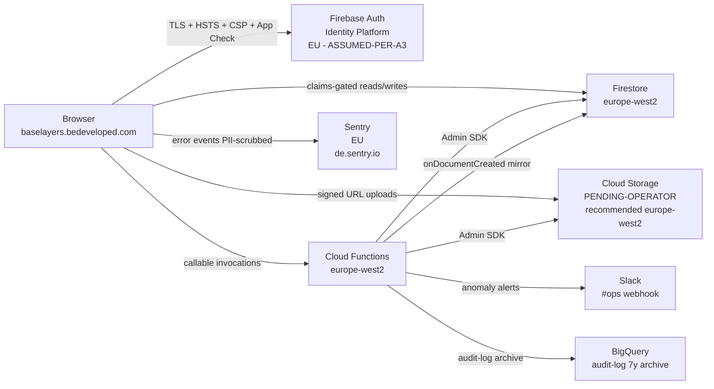

# Data Flow — Base Layers Diagnostic

**Last updated:** 2026-05-10
**Scope:** Production application at `baselayers.bedeveloped.com` + the Firebase project `bedeveloped-base-layers`.
**Companion documents:** `PRIVACY.md` (sub-processors + residency + DSR flow), `SECURITY.md` (controls), `THREAT_MODEL.md` (STRIDE register), `docs/RETENTION.md` (retention periods + deletion mechanisms).

## Diagram

The diagram below renders natively on GitHub via the standard ` ```mermaid ` fenced-block convention; no plugin is required.



*Auth region (Identity Platform) is **ASSUMED-PER-A3** pending the operator's Firebase Console verification — see `PRIVACY.md` § 3 and the verification path documented in `.planning/phases/11-documentation-pack-evidence-pack/11-02-VERIFICATION-LOG.md` § A3.*

*Cloud Storage region is **PENDING-OPERATOR** verification — see `PRIVACY.md` § 3 and the verification log § A1 for the paste-ready `gcloud storage buckets describe` command. The recommended region is `europe-west2` per the project's configuration pattern (Phase 6 D-09); PRIVACY.md and this document are updated inline once the verification lands.*

## Data classifications

| Class | Examples | Storage location | Encryption | Access control |
|-------|----------|------------------|------------|----------------|
| Customer business data | Pillar responses, comments, documents, chat messages, action items | Firestore + Cloud Storage (PENDING-OPERATOR region; recommended `europe-west2`) | Encrypted at rest by GCP (AES-256); TLS 1.2+ in transit | Firestore Rules orgId-scoped (`request.auth.token.orgId == resource.data.orgId`); admin override via `request.auth.token.role == "admin"` custom claim |
| User account data | Email, MFA enrolment metadata (TOTP factor identifiers), custom claims (`role` / `orgId` / `firstRun`) | Firebase Auth (EU — ASSUMED-PER-A3) + Firestore `users/{uid}` in `europe-west2` | Encrypted at rest by GCP; Identity Platform owns the credential surface (no passwords stored by BeDeveloped) | Firebase Auth ID tokens; Admin SDK only for claims set (server-side, gated by `beforeUserCreated` + Phase 6 D-09 Path B fallback) |
| Operational data | Audit log entries, rate-limit buckets, auth-failure counters (IP-hashed), redactionList | Firestore (`europe-west2`) + BigQuery 7-year archive sink (`europe-west2`) | Encrypted at rest by GCP; PII scrubbed via the shared `PII_KEYS` dictionary before any client-bound write | Server-only writes (`allow write: if false` for clients); audited user cannot read their own entries (Pitfall 17 carve-out); BigQuery sink IAM-restricted to `audit-alert-sa` |
| Error telemetry | Stack traces (PII-scrubbed via shared `PII_KEYS` dictionary), breadcrumbs, performance traces | Sentry EU (`*.ingest.de.sentry.io`) | TLS 1.2+ in transit; Sentry-side encryption at rest per Sentry DPA (`https://sentry.io/legal/dpa/`) | Sentry organisation access (BeDeveloped staff only); Sentry is a sub-processor of BeDeveloped per `PRIVACY.md` § 2 |

## Processing regions

- **Primary:** `europe-west2` (London) — Firestore (VERIFIED 2026-05-08T20:30:00Z via `gcloud firestore databases describe`), Cloud Functions (Phase 6 D-09 region-pinning decision; Phase 6/7/8/9 functions all carry `region: "europe-west2"` in source), Cloud Storage (PENDING-OPERATOR verification — recommended `europe-west2` per project configuration pattern, see `PRIVACY.md` § 3).
- **Auth:** EU (Identity Platform region — **ASSUMED-PER-A3** pending Firebase Console verification; see `PRIVACY.md` § 3 + `.planning/phases/11-documentation-pack-evidence-pack/11-02-VERIFICATION-LOG.md` § A3).
- **Telemetry:** EU (`*.ingest.de.sentry.io`; VERIFIED via `vite.config.js:36` `url: "https://de.sentry.io/"` + `src/observability/sentry.js:9` DSN form).
- **Logs:** `europe-west2` (Cloud Logging follows function region; logs for `europe-west2`-deployed functions stay in `europe-west2`).

---

**Cross-references:**

- `PRIVACY.md` § 2 (Sub-processors), § 3 (Data residency), § 6 (International transfers) — the authoritative residency narrative; this diagram is its visual companion.
- `SECURITY.md` § Cloud Functions Workspace + § Audit Log Infrastructure + § Observability — Sentry + § Authentication & Sessions — narrative descriptions of the specific transitions shown here.
- `THREAT_MODEL.md` § Trust boundaries — the four boundaries map directly to the Client / Auth / Firestore / Storage / Functions edges in the diagram above.
- `docs/RETENTION.md` — retention periods + deletion mechanisms for each data class shown in the table above.
